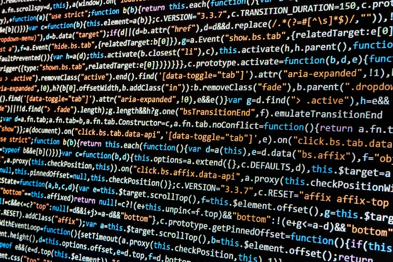

{}

## Programming

^[https://pxhere.com/en/photo/1172040]

_Programming_ is the act of writing _source code_ for a computer program in such a way that a modern computer can understand and perform the steps described in the code. There are many different _programming languages_ that can be used, such as _high-level languages_ like Java and Python.

To run code written in those languages, we can use a _compiler_ to convert the code to a _low-level language_ that can be directly executed by the computer, or we can use an _interpreter_ to read the code and perform the requested operations on the computer.

At this point, we have most likely written some programs already. This chapter will review the important aspects of our chosen programming language, giving us a solid basis to build upon. Hopefully most of this will be review, but there may be a few new terms or concepts introduced here as well.

