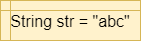
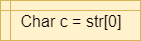

{}

Strings are another very important data type in programming. A _string_ is simply a set of characters that represent text in our programs. We can then write programs that use and manipulate strings in a variety of ways, allowing us to easily work with textual data.

## Strings in Flowcharts & Pseudocode

The table below lists the flowchart blocks used to represent strings, as well as the corresponding pseudocode:

| Operation | Flowchart | Pseudocode |
|:---------:|:---------:|:-----------|
| Create String |  | <pre><code>STR = "abc"</code></pre> |
| Access Character |  | <pre><code>C = STR[0]</code></pre> |
| String Length |  | <pre><code>X = size of STR</code></pre> |

## Strings in Java

Let's review the syntax for working with strings in Java.

### String Creation

Strings in Java are declared just like any other variable:

```java
String s = "abc123";
```

Notice that strings are enclosed in double quotations marks `"`, whereas a single character is enclosed in single quotation marks:

```java
char c = 'a';
```

There are several special characters we can include in our strings. Here are a few of the more common ones:
* `\'` - Single Quotation Mark (usually not required)
* `\"` - Double Quotation Mark
* `\n` - New Line
* `\t` - Tab

### String Parsing

{}

Most of the time, we will need to be able to _parse_ strings in order to read input from the user. This is easily done using the `Scanner` class in Java. Let's refer to the skeleton code given in the earlier exercise:

```java
// Load required classes
import java.util.Scanner;
import java.io.File;

public class Exercise1{
  
    public static void main(String[] args) throws Exception{

        // Scanner variable
        Scanner reader;

        // If an argument is present, we are reading from a file
        // specified in args[0]
        if(args.length > 0){
          reader = new Scanner(new File(args[0]));

        // If no argument, read from System.in
        }else{
          reader = new Scanner(System.in);
        }

        // read a single integer from input
        int x = reader.nextInt();

        /* -=-=-=-=- MORE CODE GOES HERE -=-=-=-=- */

    }
}
```

This code will initialize a `Scanner` to read input from a file if one is provided as a command-line argument. Otherwise, input will be read from the terminal, or `System.in` in Java.

Once we have a `Scanner` initialized, we can use several methods to read data from the input:

```java
int x = reader.nextInt();
double y = reader.nextDouble();
String x = reader.next();
String line = reader.nextLine();
```

We can find a list of all `Scanner` methods in the [Java API Documentation](https://docs.oracle.com/javase/8/docs/api/java/util/Scanner.html). 

Finally, if we have read an entire string of input consisting of multiple parts, we can use the `split` method to split the string in to _tokens_ that are separated by a special _delimiter_. When we do this, we'll have to use special methods to convert the strings to other primitive data types. Here's an example:

```
String line = "This 1 is 2.0 true";
String[] parts = line.split(" ");
String first = parts[0];
int second = Integer.parseInt(parts[1]);
String third = parts[2];
double fourth = Double.parseDouble(parts[3]);
boolean fifth = Boolean.parseBoolean(parts[4]);
```

In this example, we are able to split the first string variable into $5$ parts, each one separated by a space in the original string. Then, we can use methods such as `Integer.parseInt()` to convert each individual string token into the desired data type.

### Reading Input in a Loop

When reading an unknown number of lines of input, we can use a loop in Java such as the following example:

```java
while(reader.hasNextLine()){
  String line = reader.nextLine();
  
  if(line.length() == 0){
    break;
  }
  
  //parse the input
}
```

This will read input until either a blank line is received (usually via the terminal), or there is no more input available to read (from a file). 

### String Operations

There are also several operations we can perform on Strings in Java:

```java
String s1 = "This";
String s2 = "That";

// string length
int x = s1.length();

// string comparison
// do not use == 
boolean b = s1.equals(s2);
int x = s1.compareTo(s2);

// concatenation
String s3 = s1 + " " + s2;
```

Additional methods can be found in the [Java API Documentation](https://docs.oracle.com/javase/8/docs/api/java/lang/String.html)

### String Formatting

Strings can also be used to create formatted output in Java through the use of the `format()` method. Here's a short example:

```java
int sum = 123;
double avg = 1.23;
String name = "Student";

String output = "%s: Your score is %d with an average of %f.";

System.out.println(String.format(output, name, sum, avg));
```

When we run this program, the output will be:

```tex
Student: Your score is 123 with an average of 1.230000.
```

Each item in the formatted output can also be given additional attributes such as _width_ and _precision_. More details can be found in the [Java API Documentation](https://docs.oracle.com/javase/8/docs/api/java/util/Formatter.html#syntax)

## References

* [Scanner](https://docs.oracle.com/javase/8/docs/api/java/util/Scanner.html)
* [String](https://docs.oracle.com/javase/8/docs/api/java/lang/String.html)
* [String Formatter Syntax](https://docs.oracle.com/javase/8/docs/api/java/util/Formatter.html#syntax)
