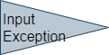
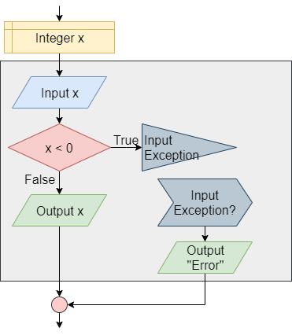

{}

An _exception_ is an error that a program encounters when it is running. While some errors cannot be dealt with directly by the program, many of these exceptions can be _caught_ and _handled_ directly in our programs. 

## Exceptions in Flowcharts & Pseudocode

There isn't really a standard way to display exceptions in flowcharts and pseudocode, but we can easily create a system that works well for our needs. Below are the flowchart blocks and pseudocode examples we'll use in this course to represent exceptions and exception handling:

| Operation | Flowchart | Pseudocode |
|:---------:|:---------:|:-----------|
| Throw Exception |  | <pre><code>throw INPUT EXCEPTION</code></pre> |
| Catch Exception |  | <pre><code>catch INPUT EXCEPTION</code></pre> |
| Try-Catch Example |  | <pre><code>X = 0<br>try<br>    input X<br>    if X &lt; 0<br>        throw INPUT EXCEPTION<br>    end if<br>    print X<br>catch INPUT EXCEPTION<br>    print "Error"<br>end try</code></pre> |

## Exceptions in Java

Let's review the syntax for working with exceptions in Java.

### Try-Catch

In Java, we can use a **Try-Catch** statement to detect and handle exceptions in our code:

```java
import java.util.Scanner;
import java.io.File;
import java.lang.Exception;

public class Example{

    public static void main(String[] args){
        Scanner reader;
        try{
            reader = new Scanner(new File(args[0]));
            int x = reader.nextInt();
            System.out.println(x);
        }catch(Exception e){
            System.out.println("Error!");
        }
    }
}
```

In this example, the program will try to open a file using the first command-line argument as a file name. There are several exceptions that could occur in this code, such as an `ArrayIndexOutOfBoundsException`, a `FileNotFoundException`, an `IOException`, and more. They can also be handled individually:

```java
import java.util.Scanner;
import java.io.File;
import java.io.FileNotFoundException;
import java.io.IOException
import java.util.InputMismatchException;
import java.lang.ArrayIndexOutOfBoundsException;

public class Example{

    public static void main(String[] args){

        Scanner reader;
        try{
            reader = new Scanner(new File(args[0]));
            int x = reader.nextInt();
            System.out.println(x);
        }catch(ArrayIndexOutOfBoundsException e){
            System.out.println("Error: Array Index Out Of Bounds!");
        }catch(FileNotFoundException e){
            System.out.println("Error: File Not Found!");
        }catch(IOException e){
            System.out.println("Error: IO Exception!");
        }catch(InputMismatchException e){
            System.out.println("Error: Input Does Not Match Expected Format!");
        }
    }
}
```

### Throw

If desired, we can also _throw_ our own exceptions in Java:

```java
if(y == 0.0){
    throw new ArithmeticException("Divide by Zero!");
}else{
    System.out.println(x / y);
}
```

This will cause an exception to be thrown if the value of `y` is equal to $0.0$. 

### Finally

We can also add a **Finally** block at the end of each **Try-Catch** block. This code will be executed whenever the control exits the **Try-Catch** block, even through the use of a `return` statement to return from a method. 

```java
import java.util.Scanner;
import java.io.File;
import java.lang.Exception;

public class Example{

    public static void main(String[] args){
        Scanner reader;
        try{
            reader = new Scanner(new File(args[0]));
            int x = reader.nextInt();
            System.out.println(x);
        }catch(Exception e){
            System.out.println("Error!");
        }finally{
            System.out.println("Finally Block!");
        }
    }
}
```

### Try with Resources

When working with resources such as files in Java, we can also use a **Try with Resources** block to ensure that those resources are properly closed when we are done with them. In addition, a **Try with Resources** block will automatically catch and suppress any exceptions that result from trying to close the resource after an exception has occurred, preventing us from being bombarded by unavoidable exceptions. Here's an example:

```java
import java.util.Scanner;
import java.io.File;
import java.util.InputMismatchException;
import java.io.FileNotFoundException;

public class Resources{
  
    public static void main(String[] args){
        try(
            Scanner reader = new Scanner(new File(args[0]))
        ){
            int x = reader.nextInt();
            System.out.println(x + 5);
        }catch(InputMismatchException e){
            System.out.println("Error: Invalid Number Format!");
        }catch(FileNotFoundException e){
            System.out.println("Error: File Not Found!");
        }
    }
}
```

In this example, we are opening a `Scanner` object within parentheses after a `try` keyword. That `Scanner` will automatically be closed once the program leaves the **Try with Resources** block where it is declared. 

## References

* [Lesson: Exceptions](https://docs.oracle.com/javase/tutorial/essential/exceptions/index.html) from Oracle's Java Tutorials
* [Exceptions in Java](https://www.geeksforgeeks.org/exceptions-in-java/) from GeeksforGeeks
* [Built-in Exceptions in Java with Examples](https://www.geeksforgeeks.org/built-exceptions-java-examples/) on GeeksforGeeks
