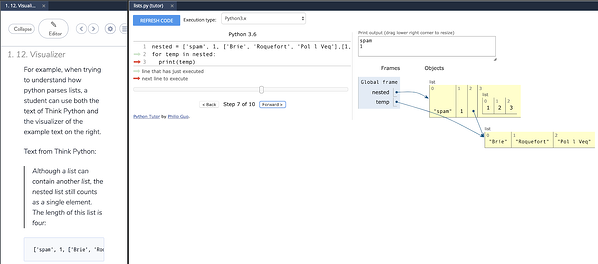

Codio also includes an integrated debugger, which is very helpful when we want to determine if there is an error in our code. We can also use the debugger to see what values are stored in each variable at any point in our program.

To use the debugger, find the **Debug Menu** at the top of the Codio window. It is to the right of the Run Menu we've already been using. On that menu, we should see an option for **Python - Debug File**. Select that option to run our program in the Codio debugger.

As we build more complex programs in this course, we'll be able to configure our own debugger configurations that allow us to test multiple files and operations.

The Codio debugger only works with input from a file, not from the terminal. So, to use the debugger, we'll need to make sure the input we'd like to test is stored in a file, such as [input.txt](open_file 1p-hello/input.txt), before debugging. We can then give that file as an argument to our program in our debugger configuration, and write our program to read input from a file if one is provided as an argument.

Learning how to use a debugger is a hands-on process, and is probably best described in a video. So, here are a couple of videos that should help us get up to speed on working in the Codio debugger. 

[Computational Core - Python Debugging Tutorial](https://core.cs.ksu.edu/2-cc210/2-primitive-data-types/04-python-run-debug/)
[Codio Documentation - Debugging](https://codio.com/docs/ide/features/debugging/)

We can always use the debugger to help us find problems in our code. 

## Visualizer

^[https://www.codio.com/blog/python-tutor-codio-visualizer]

Codio now includes support for [Python Tutor](http://pythontutor.com/), allowing us to visualize what is happening in our code. We can see that output in the second tab that is open to the left.

Unfortunately, students are not able to open the visualizer directly, so it must be configured by an instructor in the Codio lesson. If you find a page in this textbook where you'd like to be able to visualize your code, please post in Piazza and let us know!
