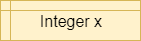
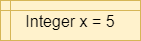

{}

A variable in a programming language is an abstraction that allows storing one value in each instant of time, but this value can change along with the program execution. A variable can be represented as a box holding a value. If the variable is a container, e.g., a list (or array or vector), a matrix, a tuple, or a set of values, each box in the container contains a single value. 

## Characteristics

A variable is characterized by:

1. An identifier or **name**. The name represents the most important information since it allows us to identify the variable inside the program. This name has to be unique inside the program and it allows us to identify the variable. In order to improve program legibility, and facilitate debugging,  and understanding it is important to choose a _representative_ name for the variable that clearly represents the function of the variable. _Representative_ names could be `results`, `number_of_nodes`, `number_of_edges`. For writing variable names composed of two or more words in Python we can use underscores to separate the words.
1. A single **value**, i.e. the value that is stored in the variable. The value of the variable can be modified during program execution but at each instant of time, the variable holds a single value. 
1. A **data type**. The data type characterizes the set of values that the variable can take. For example, the integer type contains numbers without a decimal part. The decimal or floating point type contains numbers with a decimal part. In mathematics, we call these real numbers. The string type (text) characterizes character sequences, and the Boolean type contains true or false values and is used to hold the result of the conditions. In some untyped languages, like Scratch and Python, the data type is deduced from the value that contains the variable. Since the value can change, its type can also change. For example, a variable can contain an integer value at the beginning of the program, a value that is subsequently changed to a real number. In other programming languages, such as Java, the type must be explicitly indicated at the time of declaration and cannot change.
4)	A **memory address**, which is the memory address, in the RAM of the computer, where the value is stored. We won't work directly with memory addresses in this course, but we may see them when using a visualizer or debugger to execute our programs.

## Other Features

Depending on the programming language, we could also specify for a variable:

1. **Visibility**. An area of visibility or purpose, which is where inside the program the variable is visible. In Python and Java, visibility can be specified at the global level, i.e. visible in all the program, or local, i.e. visible at the individual procedure level. 
2.	A **lifetime**. The lifetime of a variable is closely related to its visibility: when the program performs an instruction outside the purpose of the variable, i.e. outside the **scope** of a variable, the variable itself ends its life.

## Variable Operations

A programming language allows to perform two basic operations with a variable: 

1. Reading the value of a variable. This value can be used in expression allowing to relate variables by means of operators. The basic operators are: 
   1. Arithmetic operators: such as addition `+`, and subtraction `-`. They allow performing basic arithmetic operations with numbers.
   1. Comparison operators: such as less than `<`, and greater than `>`. Usually, they allow to comparing two operands, each of which could be a variable. The result of the comparison is either the Boolean value `true` or the Boolean value  `false`. 
   1. Logic operators: such as `and` , `or`, and `not`. This operator allows us to relate logical conditions together to create more complex statements.
   1. String operators: such union or concatenation of strings of characters. For example, we can use the plus symbol `+` to concatenate the strings "Hello" and the string "world" to produce the string "Hello world".  These operators allow us to manipulate strings. 
1. Writing or storing a value inside a variable. This can be performed by an assignment operation such as `a = b`.

## Variables in Flowcharts & Pseudocode

The table below lists the flowchart blocks used to represent variables, as well as the corresponding pseudocode:

| Operation | Flowchart | Pseudocode |
|:---------:|:---------:|:-----------|
| Declare |  | `X = 0` |
| Assign |  | `X = 5` |
| Declare & Assign |   | `X = 5` |

Notice that variables must be assigned a value when declared in pseudocode. By default, most programming languages automatically assign the value $0$ to a new integer variable, so we'll use that value in our pseudocode as well.

Likewise, variables in a flowchart are given a type, whereas variables in pseudocode are not. Instead, the data type of those variables can be inferred by the values stored in them.

## Variables in Python

Variables in Python are simply defined by giving them a value. The type of the variable in inferred from the data stored in it at any given time, and a variable's type may change throughout the program as different values are assigned to it.

To define a variable, we can simply use an assignment statement to give it a value:

```python
x = 5
y = 3.5
```

## Casting

We can also convert, or _cast_, data between different types. When we do this, the results may vary a bit due to how computers store and calculate numbers. So, it is always best to fully test any code that casts data between data types to make sure it works as expected.

To cast, we can simply use the new type as a _function_ and place the value to be converted in parentheses:

```python
x = 1.5
y = int(x)
```

This will convert the floating point value stored in `x` to an integer value stored in `y`. 
