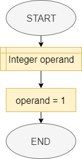
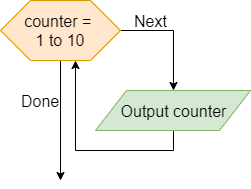
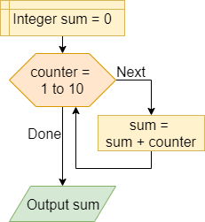
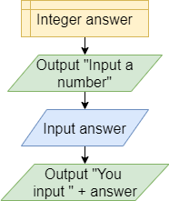
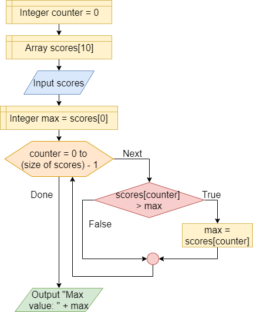
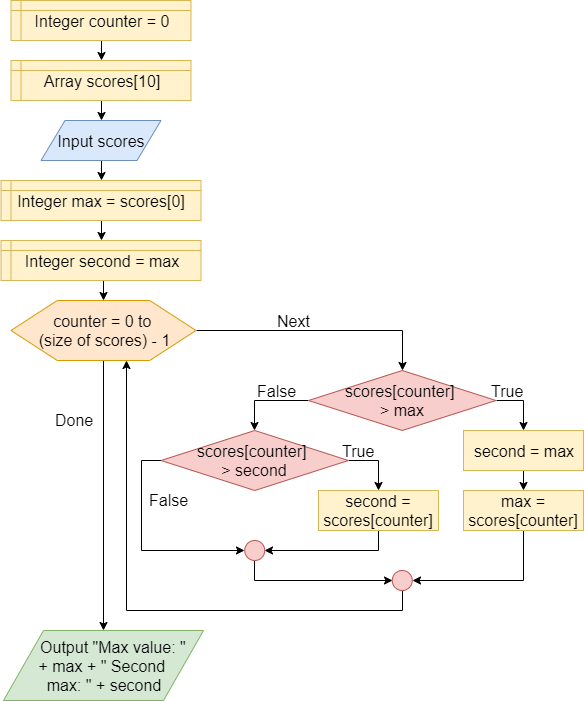
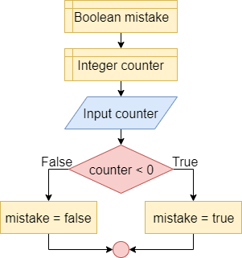
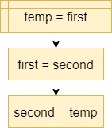
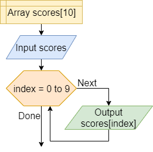

Variables in our programs can be used in a variety of different roles. The simplest role for any variable is to store a value that does not change throughout the entire program. Most variables, however, fit into one of several roles throughout the program. 

To help us understand these roles, let's review them in detail here. As we move forward in this course, we'll see many different data structures that use variables in these ways, so it helps to know each of them early on!

## Container



```tex
OPERAND = 1
```

In this role, the variable is used to hold a value. This value can be changed during the program execution. In the example:

1. a variable named `operand` of type Integer is declared
2. the value 1 is assigned to the variable

## Counter



```tex
loop COUNTER from 1 to 10
    print COUNTER
end loop
```

In this role, variables are used to hold a sequence of values known beforehand. In the example, the variable `counter` holds values from 1 to 10 and these values are conveyed to the user.

## Accumulator



```tex
SUM = 0
loop COUNTER from 1 to 10
    SUM = SUM + COUNTER
end loop
print SUM
```

In this role, the variable is used to hold a value that aggregates, summarizes, and synthesize multiple values by means of an operation such as sum, product, mean, geometric mean, or median. In the example, we calculate the sum of the first ten numbers in the accumulator variable `sum`.

## Recent Value



```tex
ANSWER = 0
print "Input a number"
input ANSWER
print "You input " + ANSWER
```

In this role, the variable `answer` contains the last value encountered so far in a data series, such as the last value that the program receives from the user.

## Extreme Value



```tex
COUNTER = 0
SCORES = new array[10]
input SCORES
MAX = SCORES[0]
loop COUNTER from 0 to (size of SCORES) - 1
    if SCORES[COUNTER] > MAX
        MAX = SCORES[COUNTER]
    end if
end loop
print "Max value: " + MAX
```

In this role, the variable contains the value that is most appropriate for the purpose of the program, e.g. the minimum or the maximum. The instruction `scores[counter] > max` checks if the list item under observation is greater than the maximum. If the condition is true the value of the maximum variable is changed.

## Follower



```tex
COUNTER = 0
SCORES = new array[10]
input SCORES
MAX = SCORES[0]
SECOND = MAX
loop COUNTER from 0 to (size of SCORES) - 1
    if SCORES[COUNTER] > MAX
        SECOND = MAX
        MAX = SCORES[COUNTER]
    else if SCORES[COUNTER] > SECOND
        SECOND = SCORES[COUNTER]
    end if
end loop
print "Max value: " + MAX + " Second max: " + SECOND
```

A variable, such as `second`, to which you assign the value of another variable that will be changed immediately after. In the example, the second variable contains the second largest value in a list.

## Flag



```tex
MISTAKE = false
COUNTER = 0
input COUNTER
if COUNTER < 0
    MISTAKE = true
else
    MISTAKE = false
end if
```

A flag variable is used to report the occurrence or not of a particular condition, e.g. the occurrence of an error, the first execution, etc..

## Temporary



```tex
TEMP = FIRST
FIRST = SECOND
SECOND = TEMP
```

A variable used to hold a temporary value. For example, to exchange two variables, you must have a temporary variable `temp` to store a value before it is replaced.

## Index



```tex
SCORES = new array[10]
input SCORES
loop INDEX from 0 to 9
    print SCORES[INDEX]
end loop
```

A variable used to indicate the position of the current item in a set of elements, such as the current item in an array of elements. The `index` variable here is a great example.

## References

* Sajaniemi, J. (2005, October). Roles of variables and learning to program. _In Proc. 3rd Panhellenic Conf. Didactics of Informatics, Jimoyiannis A (ed) University of Peloponnese, Korinthos, Greece._
* Hosanee, M., & Rana, M. E. (2018). A Refined Approach for Understanding Role of Variables in Elementary Programming. _Jour of Adv Research in Dynamical & Control Systems, 10(11)._
