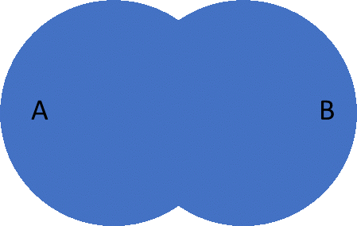
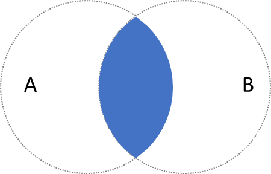
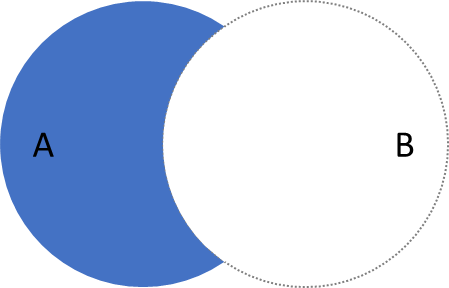
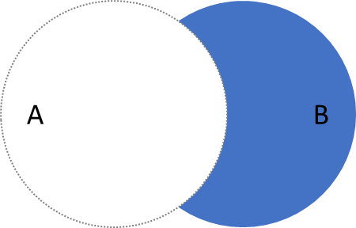
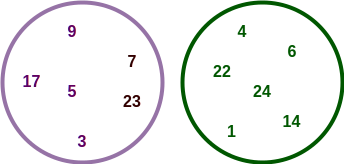
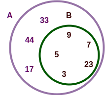
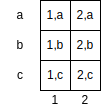

Now that we can create and show sets of various types of elements, there are a few interesting operations that we can perform on sets. Given two sets, $\text{A}$ and $\text{B}$, we can perform the following operations:

* Union $\cup$ --- a set with all the elements from both sets,
* Intersection $\cap$ --- a set with only elements that are in both sets,
* Difference $\setminus$ --- a set with the elements in one set that are not in the other,
* Disjoint $\text{A} \cap \text{B} = \emptyset$ --- two sets don't share any elements in common
* Subset $\subseteq$ --- one set is completely contained in another set
* Superset $\supseteq$ --- one set completely contains another set
* Product $\times$ --- a set of all the ordered pairs where the first element is from the first set and second element is from the second set, and
* Powerset $\wp$ --- a set of all the subsets of a given set.

We will describe each of these operations in more detail below.

## Union $\cup$

The union of two sets, $\text{A}$ and $\text{B}$, is the set of elements that belongs to either $\text{A}$ or to $\text{B}$. The following figure shows the Venn Diagram for the union of set $\text{A}$ and set $\text{B}$. In this diagram, the blue color denotes the elements of the set that are in $\text{A} \cup \text{B}$.

For our example sets $\text{A}$ and $\text{B}$ above, the union would be equivalent to the following.

$$
\text{A} \cup \text{B} = \{ 17, 9, 32, 15, 3, 5, 1, 22, 4, 6, 14 \}
$$

## Intersection $\cap$

The intersection of two sets, $\text{A}$ and $\text{B}$, includes all the elements that belong to both $\text{A}$ and $\text{B}$. The following figure shows the Venn Diagram for the intersection of set $\text{A}$ and set B. In this diagram, the blue color denotes the elements of the set that are in $\text{A} \cap \text{B}$.
 
 

For our example sets $\text{A}$ and $\text{B}$ above, the union would be equivalent to the following.

$$
\text{A} \cap \text{B} = \{ 15, 32 \}
$$

## Difference $\setminus$

The difference of two sets, $\text{A}$ and $\text{B}$, includes all the elements in $\text{A}$ that are not in $\text{B}$. The following figure shows the Venn Diagram for the difference between set $\text{A}$ and set $\text{B}$. In this diagram, the blue color denotes the elements of the set that are in $\text{A} \setminus \text{B}$.

 
 
For our example sets $\text{A}$ and $\text{B}$ above, $\text{A} \setminus \text{B}$ would be equivalent to the following.

$$
\text{A} \setminus \text{B} = \{ 17, 9, 3, 5 \}
$$

It is important to realize that the set difference is not symmetrical, which means that the operation $\text{A} \setminus \text{B}$ does not result in the same set as $\text{B} \setminus \text{A}$. $\text{B} \setminus \text{A}$ is the set composed of the elements that belong to $\text{B}$ but not to $\text{A}$. The following figure shows the Ven Diagrams for $\text{B} \setminus \text{A}$.

 
 
For our example sets $\text{A}$ and $\text{B}$ above, $\text{B} \setminus \text{A}$ would be equivalent to the following.

$$
\text{B} - \text{A} = \{ 1, 22, 4, 6, 14 \}
$$

## isDisjoint $\text{A} \cap \text{B} = \emptyset$

We say two sets are disjoint it they have no common elements. The `isDisjoint` operation returns `true` if two sets are disjoint and `false` if they are not. For example, sets $\text{A}$ and $\text{B}$ below are disjoint since they do not share any of the same numbers. A simple way of computing the value of `isDisjoint` is just to check to see if the intersection of the two sets is the empty set. If it is, then the two sets are disjoint.

 

$$
\text{A} \cap \text{B} = \emptyset \implies \text{A and B are disjoint}
$$

## isSubset $\subseteq$

We say a set $\text{B}$ is a subset of set $\text{A}$ if all of the elements of set $\text{B}$ are also elements of set A. The `isSubset` operation is an operation that determines if the subset relationship is `true` or `false` for any two sets. In the example below, set $\text{B}$ is a subset of set $\text{A}$ since all the elements of $\text{B}$ are also in the set A. Notice also that if set $\text{A}$ and $\text{B}$ are equal, then $\text{A}$ is a subset of $\text{B}$ and $\text{B}$ is a subset of $\text{A}$ as well!

 
 
Like the `isDisjoint` operation above, we can compute the `isSubset` operation using the intersection of sets $\text{A}$ and $\text{B}$. If set $\text{B}$ is equal to the intersection of sets $\text{A}$ and $\text{B}$, then $\text{B}$ is a subset of $\text{A}$.

$$
\text{A} \cap \text{B} = \text{B} \implies \text{B} \subseteq \text{A}
$$

## isSuperset $\supseteq$

We say a set $\text{A}$ is the superset of set $\text{B}$ if all the elements of $\text{B}$ are also elements of $\text{A}$. You may be thinking to yourself, "this sounds a lot like the subset operation". And you would be correct. If $\text{B}$ is the subset of $\text{A}$, then $\text{A}$ is a superset of $\text{B}$. It is saying the same thing two different ways. 

Of course, if we can compute the `isSubset` operation, we can use that directly to compute the `isSuperset` operation. Or, we can use the intersection operation as well. If set $\text{B}$ is equal to the intersection of sets $\text{A}$ and $\text{B}$, then $\text{A}$ is a superset of $\text{B}$.

$$
\text{A} \cap \text{B} = \text{B} \implies \text{A} \supseteq \text{B}
$$

## Product $\times$

The product, or Cartesian product, of two sets results in a set that includes all pairs of elements such that the first element of the pair is from the first set and the second is from the second set. Let's give a quick example to make this easier to understand. We denote a pair of elements as $(a,b)$, where $a$ is the first element in the pair and $b$ is the second element in the pair.

We start with two sets, $\text{A}$ and $\text{B}$ as defined below.

$$
\text{A} = \{ 1, 2 \} \\
\text{B} = \{ a, b, c \}
$$

Then the Cartesian product of $\text{A}$ and $\text{B}$ is 

$$
\text{A} \times \text{B} = \{ (1,a), (1,b), (1,c), (2,a), (2,b), (2,c) \}
$$

And the Cartesian product of $\text{B}$ and $\text{A}$ is

$$
\text{B} \times \text{A} = \{ (a,1), (a, 2), (b,1), (b,2), (c,1), (c,2) \}
$$

Another way to think about the product is to consider a matrix where the columns are the elements of the first set and the rows are elements of the second set. Then, each cell in the matrix contains the ordered pair where the first element is the column and the second element is the row. The matrix for our example would look like the following.

 
## Powerset 

The powerset of set $\text{A}$ is the set of all possible subsets of $\text{A}$ and is denoted as $\wp(\text{A})$. If we start with the set $\text{A} = \{ 1, 2, 3 \}$, then its powerset is

$$
\{ \emptyset, \{1 \}, \{2 \}, \{3 \}, \{1, 2 \}, \{1, 3 \}, \{2, 3 \}, \{1, 2, 3 \} \}
$$

Notice that the empty set, $\emptyset$, is a subset of the powerset of $\text{A}$ as well.
