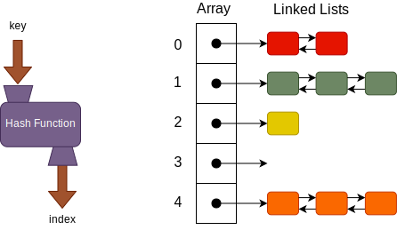

{}

A hash table is an unordered collection of key-value pairs, where each key is unique. The great thing about hash tables is that they provide efficient insertion, removal and lookup operations that arrays and linked lists cannot match, such as: 

* Retrieval operations in an unsorted array run in order $N$ time,
* Retrieval operations in a sorted array using binary search run in constant time, but insertion operations run in order $N$ time, and
* Insertion operations run in constant time in linked lists, but retrieval operations run in order $N$ time.

A hash table consists of three components:

1. An array that holds buckets where key-value pairs are stored,
1. A hash function that maps a key to a specific array index, and
1. A set of buckets that allow the hash table to store multiple key-value pairs whose keys map to the same index in the array; we implement our buckets using linked lists.

A user basically stores a key-value pair in the hash table where the key is used to identify the key-value pair as well as compute where it will be stored. For instance, if we consider all the students in a university, we can store student information (name, address, phone, major, GPA, courses, etc.) in the hash table using their name as the key. 
Storing a key-value pair in a hash table uses the following procedure. 

1. The user presents a key-value pair to be stored in the hash table.
1. The key is run through a hash function, which generates an index into the hash table's array. 
1. The key-value pair is stored in the bucket (linked list) referenced at that index. 

 
Retrieving a key-value pair from the hash table follows a similar procedure.

1.	The user presents the key to the key-value pair to be retrieved.
2.	The key is run through a hash function, which generates an index into the hash table's array. 
3.	The bucket referenced at that index in the array is then searched for the appropriate key.
4.	If found, the key-value pair is returned to the user.

Ideally, it would be nice if there was only a single key-value pair stored in each bucket. However, we cannot guarantee this so we use a linked list to allow us to store multiple items whose key produces the same index. 

## Dictionaries

Another data type that is similar to hash tables and is built into many modern programming languages, is the _dictionary_ or an _associative array_. A dictionary is a collection of key-value pairs that is directly indexed by a key instead of an integer. These keys can be an integer, a string, or other data types. Dictionaries typically support the following operations:

1. Add a key-value pair to the collection,
1. Remove a key-value pair from the collection,
1. Modify an existing key-value pair in the collection, and
1. Lookup a value associated with a given key.

As you can see dictionaries and hash tables are very similar in their basic operation. However, an important difference is that hash tables tend to allow any type of objects as the value in the key-value pairs, while dictionaries typically require a specific type of object to be the value. A dictionary can be implemented using a variety of data structures including linked lists and hash tables.
