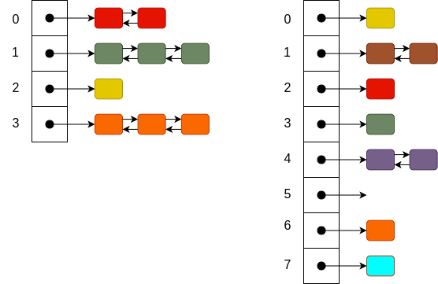
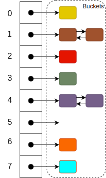

As stated previously, a hash table has three main components: an array, a hash function, and a set of buckets that store key-value pairs. We discuss the implementation of these below.

## Array

We use an array to hold pointers to the buckets where the key-value pairs are stored. While the array itself is a common data type found in almost every language, there are some important aspects to the arrays used in hash tables. 

First, the array must be large enough to store our key-value pairs without too many collisions. A collision occurs when two key-value pairs map to the same array index. Although we cannot keep this from happening, the fewer collisions, the faster the hash table. Thus, the larger the array, the lower the chance for collisions. We capture the size of the array as its _capacity_. 

In the example below, both hash tables are storing the same number of key-value pairs. However, the capacity of the array on the right is more than twice as large as the one on the left. To retrieve a random key-value pair from each of these arrays requires a search of one of the linked list buckets. For the array on the left, the average number of nodes searched is $1.8$, while for the array on the right it is only $1.2$. Thus, in this example doubling the capacity of our array provides a $33\%$ reduction in the time required to retrieve a key-value pair. (Note that these statistics were computed based on these particular array capacities and the number of key-value pairs in the example.)

 
Second, the array should be re-sizable. Since we generally do not know in advance how many key-value pairs we have to store in our hash table, we need to be able to resize our array when the number of key-value pairs reaches a predefined threshold. This threshold is based on the loading factor, which we define next.

## Load Factor

As we store more key-value pairs in a hash table, the number of collisions will increase. The more collisions we have, the less efficient our hash table will become. Thus, at some point, it makes sense to increase the capacity of the array and _rehash_ our table, which means we compute new indexes for all key-value pairs and add them into the new array. The question is, when is the appropriate time to do this?

Traditionally, we answer this question using a ratio of the capacity of the hash table array to the number of key-value pairs stored in the table. There are three key properties of hash tables that come into play here:

* The _capacity_ of the array,
* The _size_ of the hash tables in terms of the number of key-value pairs stored in the table,
* The _load factor_ (or ratio) between the size of the hash table and its capacity, $\text{size} / \text{capacity}$.

Typically, when the load factor reaches a specified threshold, we double the capacity of the array and then rehash the table using the new array. The load factor threshold we choose is a tradeoff between space and time. The larger the array, the more memory you use, but with fewer collisions. Obviously, using a smaller array increases the number of collisions as well as the time it takes to retrieve key-value pairs from the table. For our examples below, we use the standard default load factor of $0.75$.

## Buckets

If our array was large enough to ensure our hash function would compute a unique index for each key (i.e., there would be absolutely no collisions), we could store the key-value pairs directly in the array. Unfortunately, this is almost never the case and collisions do occur. Therefore, we store the key-value pairs in buckets associated with each array index. _Buckets_ are the general term we use to describe the mechanism we use to store key-value pairs and handle any collisions that occur. As shown in the figure below, we use linked lists to implement our buckets, which is a fairly standard approach.

 
As we recall, linked lists provide constant time operations for adding key-value pairs to the list and linear time operations for retrieving key-value pairs from the list. While linear time seems slow for adding a key-value pair to the list, we need to remember that we are talking only about the number of key-value pairs in a specific list, not the total number of key-value pairs in the entire hash table. Thus, as shown in the figure above, the maximum number of key-value pairs in any linked list is $2$, even though the size of the entire table is $9$. With a load factor of $0.75$ and a good quality hash function that distributes key-value pairs uniformly across the array, our linked lists generally have a small number of items ($2$ or $3$ maximum) in each list. So, even though retrieving is not technically constant time, because it is very close to it in practice, we say that it is.
