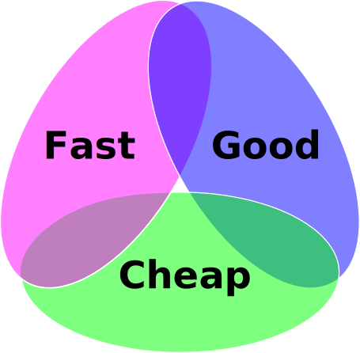

{}

There are several linear data structures that we can use in our programs, including stacks, queues, lists, sets, and hash tables. In this course, we have covered each of these structures in detail. However, as a programmer, one of the most difficult decisions we will make when developing a program is the choice of which data structure to use. Sometimes the choice may be obvious based on the data we plan to store or the algorithms we need to perform, but in practice that happens very rarely. Instead, we are faced with competing tradeoffs between various factors such as ease of use, performance, and simplicity. 

In this chapter, we'll review the various data structures and algorithms we've learned about in this course, but this time we'll add a bit more focus on the decisions a programmer would make when choosing to use a particular data structure or algorithm.

## Three Important Questions

The choice of which data structure to use is often the most consequential choice we make when developing a new piece of software, as it can have a large impact on the overall performance of the program. While there are many different factors to consider, here are three important questions we can ask when choosing a data structure:

1. **Does it Work?** Above all else, the choice of a data structure must allow the program to complete its work correctly. If the program cannot function properly due to the choice of data structure, then all other factors can effectively be ignored. So, when developing a new program, we should first focus on choosing a data structure that we know will be able to complete the task. Thankfully, with a bit of programming ingenuity, most data structures can be used to complete most tasks, albeit poorly or inefficiently. In those cases, the next two questions will help us further narrow our choice.
1. **Is it Understandable?** Once we have chosen a few data structures to analyze, the next factor we must deal with is understandability. If we cannot understand how to use our chosen data structure to perform the task, or if the method we use is so complex that it is difficult for us to explain to others, it is very likely that we've made a poor choice. In most cases, the best choice of data structure will lead to the most straightforward and understandable implementation. The only exceptions to this are cases where we must deal with extremes of performance or limits on capability. In those extreme cases, many times a more complex answer ends up being the best one due to the limitations imposed on the system. 
1. **Is it Performant?** In programming, we use the term performant to characterize programs that exhibit a high level of performance and efficiency. So, when choosing a data structure to use in our program, we may want to choose one that is most likely to exhibit high levels of performance and efficiency while we use it. As we have learned throughout this course, different data structures are developed with different uses in mind, and it is a very good idea for us to keep that in mind when making our choice. In this chapter, we will spend some time reviewing these performance and efficiency factors for the various data structures we have covered so far, helping us make more informed choices. 

By answering the questions above in the order they are presented, we should be able to make good decisions about which data structures would work best in our program. We are purposely putting more focus on writing working and understandable code instead of worrying about performance. This is because many programs are only used with small data sets on powerful modern computers, so performance is not the most important aspect. However, there are instances where performance becomes much more important, and in those cases more focus can be placed on finding the most performant solution as well. 

As it turns out, these three questions are very similar to a classic (trilemma)[https://en.wikipedia.org/wiki/Trilemma] from the world of business, as shown in the diagram below.

^[File:Project-triangle.svg. (2020, January 12). Wikimedia Commons, the free media repository. Retrieved 21:09, April 30, 2020 from https://commons.wikimedia.org/w/index.php?title=File:Project-triangle.svg&oldid=386979544.]
 
In the world of software engineering, it is said that the process of developing a new program can only have two of the three factors of "good", "fast", and "cheap". The three questions above form a similar trilemma. Put another way, there will always be competing tradeoffs when selecting a data structure for our programs. 

For example, the most performant option may not be as easy to understand, and it may be more difficult to debug and ensure that it works correctly. A great example of this is matrix multiplication, a very common operation in the world of high-performance computing. A simple solution requires just three loops and is very easy to understand. However, the most performant solution requires hundreds of lines of code, assembly instructions, and a deep understanding of the hardware on which the program will be executed. That program will be fast and efficient, but it is much more difficult to understand and debug.
