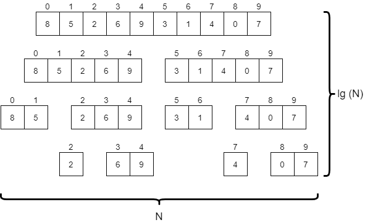
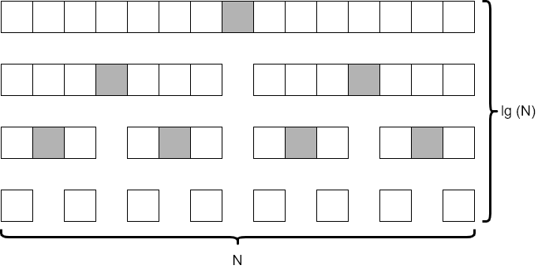
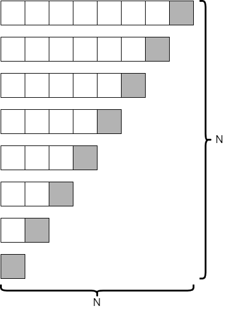

{}

We can examine the performance of the algorithms we use in a similar manner. Once again, we are concerned with both the memory usage and processing time of the algorithm. In this case, we are concerned with the amount of memory required to perform the algorithm that is above and beyond the memory used to store the data in the first place.

When analyzing searching and sorting algorithms, we'll assume that we are using arrays as our data structure, since they give us the best performance for accessing and swapping random elements quickly.

## Searching

There are two basic searching algorithms: linear search and binary search.

For linear search, we are simply iterating through the entire data structure until we find the desired item. So, while we can stop looking as soon as it is found, in the worst case we will have to look at all the elements in the structure, meaning the algorithm runs in order $N$ time. 

 
Binary search, on the other hand, takes advantage of a sorted array to jump around quickly. In effect, each element we analyze allows us to eliminate half of the remaining elements in our search. With as few as 8 steps, we can search through an array that contains 64 elements. When we analyze this algorithm, we find that it runs in order $\text{lg}(N)$ time, which is a vast improvement over binary search. 

Of course, this only works when we can directly access elements in the middle of our data structure. So, while a linked list gives us several performance improvements over an array, we cannot use binary search effectively on a linked list. 

In terms of memory usage, since both linear search and binary search just rely on the original data structures for storing the data, the extra memory usage is constant and consists of just a couple of extra variables, regardless of how many elements are in the data structure. 

## Sorting

We have already discussed how much of an improvement binary search is over a linear search. In fact, our analysis showed that performing as few as 7 or 8 linear searches will take more time than sorting the array and using binary search. Therefore, in many cases we may want to sort our data. There are several different algorithms we can use to sort our data, but in this course we explored four of them: selection sort, bubble sort, merge sort, and quicksort.

The selection sort algorithm involves finding the smallest or largest value in an array, then moving that value to the appropriate end, and repeating the process until the entire array is sorted. Each time we iterate through the array, we look at every remaining element. In the module on sorting, we showed (through some clever mathematical analysis) that this algorithm runs in the order of $N^2$ time. 

Bubble sort is similar, but instead of finding the smallest or largest element in each iteration, it focuses on just swapping elements that are out of order, and eventually (through repeated iterations) sorting the entire array. While doing so, the largest or smallest elements appear to "bubble" to the appropriate end of the array, which gives the algorithm its name. Once again, because the bubble sort algorithm repeatedly iterates through the entire data structure, it also runs on the order of $N^2$ time.

Both selection sort and bubble sort are inefficient as sorting algorithms go, yet their main value is their simplicity. They are also very nice in that they do not require any additional memory usage to run. They are easy to implement and understand and make a good academic example when learning about algorithms. While they are not used often in practice, later in this module we will discuss a couple of situations where we may consider them useful. 

 
Merge sort is a very powerful divide and conquer algorithm, which splits the array to be sorted into progressively smaller parts until each one contains just one or two elements. Then, once those smaller parts are sorted, it slowly merges them back together until the entire array is sorted. We must look at each element in the array at least once per "level" of the algorithm in the diagram above, so overall this algorithm runs in the order of $N * \text{lg}(N)$ time. This is quite a bit faster than selection sort and bubble sort. However, most implementations of merge sort require at least a second array for storing data as it is merged together, so the additional memory usage is also on the order of $N$. 

 
Quicksort is a very clever algorithm, which involves selecting a "pivot" element from the data, and then dividing the data into two halves, one containing all elements less than the pivot, and another with all items greater than the pivot. Then, the process repeats on each half until the entire structure is sorted. 
In the ideal scenario, shown in the diagram above, quicksort runs on the order of $N * \text{lg}(N)$ time, similar to merge sort. However, this depends on the choice of the pivot element being close to the median element of the structure, which we cannot always guarantee. Thankfully, in practice, we can just choose a random element (such as the last element in the structure) and we'll see performance that is close to the $N * \text{lg}(N)$ target.
 
 
 
However, if we choose our pivot element poorly, the worst case scenario shown in the diagram above can occur, causing the run time to be on the order of $N^2$ instead. This means that quicksort has a troublesome, but rare, worst case performance scenario.
