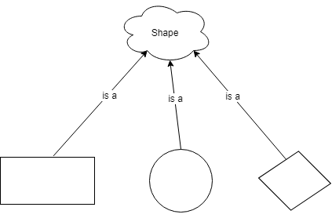
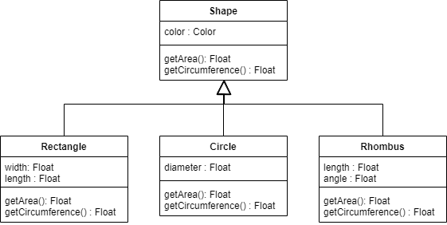

{}

## Polymorphism
 
Polymorphsim is a concept that describes the fact that similar objects tend to behave in similar ways, even if they are not exactly alike. For example, if we might have a set of shapes such as a square, a circle, and a rhombus. While each shape shares certain attributes like having an area and a perimeter. However, each shape is also unique and may have differing number of sides and angles between those sides, or in the case of a circle, a diameter. We describe this relationship by saying a circle (or rectangle, or rhombus) "is a" shape as shown in the figure below.
 

## Inheritance

Inheritance is a mechanism that captures polymorphism by allowing classes to _inherit_ the methods and attributes from another class. The basic purpose of inheritance to to reuse code in a principled and organized manner. We generally call the inheriting class the _subclass_ or _child class_, while the class it inherits from is called the _superclass_ or _parent class_.

Basically, when class 'A' inherits from class 'B', all the methods and attributes of class 'A' are automatically copied to class 'B'. Class 'B' can then add additional methods or attributes to _extend_ class 'A', or overwrite the implementations of methods  in class 'A' to _specialize_ it.  

When programming, we use inheritance to implement polymorphism. In our shape example, we would have a generic (or _abstract_) Shape class, which is inherited by a set of more specific shape classes (or _specializations_) as shown below.

 
In this example, the Shape class defines the 'color' attribute and the 'getArea' and 'getCircumference' methods, which are inherited by the Rectangle, Circle, and Rhombus classes. Each of the subclasses define additional attributes that are unique to the definition of each shape type. 
 
Notice that although the Shape class defines the signatures for the 'getArea' and 'getCircumference' methods, it cannot define the implementation of the methods, since this is unique to each subclass shape. Thus, each subclass shape will specialize the Shape class by implementing their own 'getArea' and 'getCircumference' methods. 

## Multiple Inheritance

So far, we have discussed _Single inheritance_, which occurs when a class has only one superclass. However, theoretically, a class may inherit from more than one superclass, which is termed _multiple inheritance_. While a powerful mechanism, multiple inheritance also introduces complexity into understanding and implementing programs. And, there is always the possibility that attributes and methods from the various superclasses contradict each other in the subclass.
