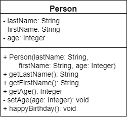

{}

We can also add methods to our classes. These methods are used either to modify the attributes of the class or to perform actions based on the attributes stored in the class. Finally, we can even use those methods to perform actions on data provided as arguments. In essence, the sky is the limit with methods in classes, so we'll be able to do just about anything we need to do in these methods. Let's see how we can add methods to our classes.



## Adding Methods

{}

To add a method to our class, we can simply add a function declaration inside of our class. In fact, all of the functions we've been creating up to this point have been inside of a class. The only difference is that we'll now be able to remove the `static` keyword from our function declarations. We'll discuss more about exactly what that keyword does later in this chapter.

```java
public class Person{
    private String lastName;
    private String firstName ;
    private int age;
    
    public String getLastName(){ return this.lastName; }
    public String getFirstName(){ return this.firstName; }
    public int getAge(){ return this.age; }
    private void setAge(int age){ this.age = age; }
    
    public void happyBirthday(){
        this.setAge(this.getAge() + 1);
    }
    
}
```

In this example, the first four methods are _getter and setter_ methods. We have three public getter methods that allow us to access the values stored in our private attributes in a read-only way. In addition, we have created a private setter method for the age attribute. This isn't technically required, since we can always just change it directly from within our code, but it is a good practice to include one. 

Lastly, we have created a `happyBirthday()` method that uses getters and setters to update the person's age by 1 year. 

{}

# Variable Scope

We've already discussed variable scope earlier in this course. Recall that variables declared inside of a block are not accessible outside of the block. Similarly, two different functions may reuse variable names, because they are in different scopes. 

The same applies to classes. A class may have an attribute named `age`, but a method inside of the class may also declare a local variable named `age`. Therefore, we must be careful to make sure that we access the correct variable, usually by using the `this` keyword to access the attribute variable. Here's a short example:

```java
public class Test{
  int age = 15;
  
  void foo(){
    int age = 12;
    System.out.println(age);      // 12
    System.out.println(this.age); // 15
  }
  
  void bar(){
    System.out.println(age); // 15
  }
}
```

As we can see, in the method `foo()` we must be careful to use `this.age` to refer to the attribute, since there is another variable named `age` declared in that method. However, in the method `bar()` we see that `age` automatically references the attribute, since there is no other variable named `age` defined in that scope. 

This can lead to some confusion in our code. So, we should always get in the habit of using `this` to refer to any attributes, just to avoid any unintended problems later on.

{}

## Constructors

{}


A _constructor_ is a special method that is called whenever a new instance of a class is created. It is used to set the initial values of attributes in the class. We can even accept parameters as part of a constructor, and then use those parameters to populate attributes in the class. 

Let's go back to the `Person` class example we've been working on and add a simple constructor to that class

```java
public class Person{
    private String lastName;
    private String firstName ;
    private int age;
    
    public String getLastName(){ return this.lastName; }
    public String getFirstName(){ return this.firstName; }
    public int getAge(){ return this.age; }
    private void setAge(int age){ this.age = age; }
    
    public Person(String lastName, String firstName, int age){
        this.lastName = lastName;
        this.firstName = firstName;
        this.age = age;
    }
    
    public void happyBirthday(){
        this.setAge(this.getAge() + 1);
    }
    
}
```

Inside that constructor, notice that we use each parameter to set the corresponding attribute, using the `this` keyword once again to refer to the current object. 

## Instantiation

{}

Now that we have fully constructed our class, we can use it elsewhere in our code through the process of instantiation. In Java, we use the `new` keyword to create a new instance of class, which calls the constructor, and then we can use _dot-notation_ to access any attributes or methods inside of that object. 

```java
Person john = new Person("Smith", "John", 25);
System.out.println(john.getLastName());
john.happyBirthday();
```
