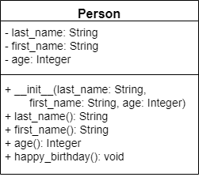

{}

In programming, a _class_ describes an individual entity or part of the program. In many cases, the _class_ can be used to describe an actual thing, such as a person, a vehicle, or a game board, or a more abstract thing such as a set of rules for a game, or even an artificial intelligence engine for making business decisions.  

In _object-oriented programming_, a class is the basic building block of a larger program. Typically each part of the program is contained within a class, representing either the main logic of the program or the individual entities or _things_ that the program will use.

## Representing Classes in UML

We can represent the contents of a class in a UML Class Diagram. Below is an example of a class called `Person`:



Throughout the next few pages, we will realize the design of this class in code.

## Creating Classes in Python

To create a class in Python, we can simply use the `class` keyword at the beginning of our file:

```python
class Person:
    pass
```

As we've already learned, each class declaration in Python includes these parts:
1. `class` - this keyword says that we are declaring a new class.
1. `Person` - this is an identifier that gives us the name of the class we are declaring.

Following the declaration, we see a colon `:` marking the start of a new block, inside of which will be all of the _fields_ and _methods_ stored in this class. We'll need to indent all items inside of this class, just like we do with other blocks in Python.

In order for Python to allow this code to run, we cannot have an empty block inside of a class declaration. So, we can add the keyword `pass` to the block inside of the class so that it is not empty. 

By convention, we would typically store this class in a file called `Person.py`. 
