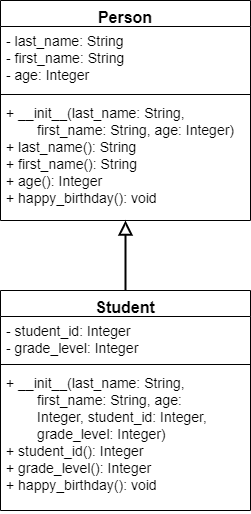

{}

We can also build classes that _inherit_ attributes and methods from another class. This allows us to build more complex structures in our code, better representing the relationships between real world objects.

## Inheritance in UML

As we learned earlier in this chapter, we can represent an inheritance relationship with an open arrow in our UML diagrams, as shown below:



In this diagram, the `Student` class inherits from, or is a subclass of, the `Person` class. 

## Inheritance in Python

To show inheritance in Python, we place the parent class inside of parentheses directly after the name of the subclass when it is defined:

```python
from Person import *

class Student(Person):
    pass
```

From there, we can quickly implement the code for each property and getter method in the new class:

```python
from Person import *

class Student(Person):
    
    @property
    def student_id(self):
        return self.__student_id
    
    @property
    def grade_level(self):
        return self.__grade_level
```

## Method Overriding

{}

Since the subclass `Student` also includes a definition for the method `happy_birthday()`, we say that that method has been _overridden_ in the subclass. We can do this by simply creating the new method in the `Student` class, making sure it accepts the same number of parameters as the original:

```python
from Person import *

class Student(Person):
    
    @property
    def student_id(self):
        return self.__student_id
    
    @property
    def grade_level(self):
        return self.__grade_level
        
    def happy_birthday(self):
        super().happy_birthday()
        self.__grade_level += 1
```

Here, we are using the function `super()` to refer to our parent class. In that way, we can still call the `happy_birthday()` method as defined in `Person`, but extend it by adding our own code as well.

## Inherited Constructors

In addition, we can use the `super()` method to call our parent class's constructor. 

```python
from Person import *

class Student(Person):
    
    @property
    def student_id(self):
        return self.__student_id
    
    @property
    def grade_level(self):
        return self.__grade_level
        
    def __init__(self, last_name, first_name, age, student_id, grade_level):
        super().__init__(last_name, first_name, age)
        self.__student_id = student_id
        self.__grade_level = grade_level
        
    def happy_birthday(self):
        super().happy_birthday()
        self.__grade_level += 1
```

## Security

In addition to private and public attributes and methods, UML also includes the concept of _protected_ methods. This modifier is used to indicate that the attribute or method should not be accessed outside of the class, but will allow any subclasses to access them. Python does not enforce this restriction; it is simply convention. In a UML diagram, the protected keyword is denoted by a hash symbol `#` in front of the attribute or method. In Python, we then prefix those attributes or methods with a single underscore `_`.

## Polymorphism

{}

Inheritance allows us to make use of _polymorphism_ in our code. Loosely polymorphism allows us to treat an instance of a class within the data type of any of its parent classes. By doing so, we can only access the methods and attributes defined by the data type, but any overriden methods will use the implementation from the child class. 

Here's a quick example:

```python
steve_student = new Student("Jones", "Steve", "19", "123456", "13")

# We can now treat steve_student as a Person object
steve_person = steve_student
print(steve_person.first_name)

# We can call happy_birthday(), and it will use
# the code from the Student class, even if we 
# think that steve_student is a Person object
steve_person.happy_birthday()

# We can still treat it as a Student object as well
print(steve_person.grade_level) # 14

```

Polymorphism is a very powerful tool in programming, and we'll use it throughout this course as we develop complex data structures. 
