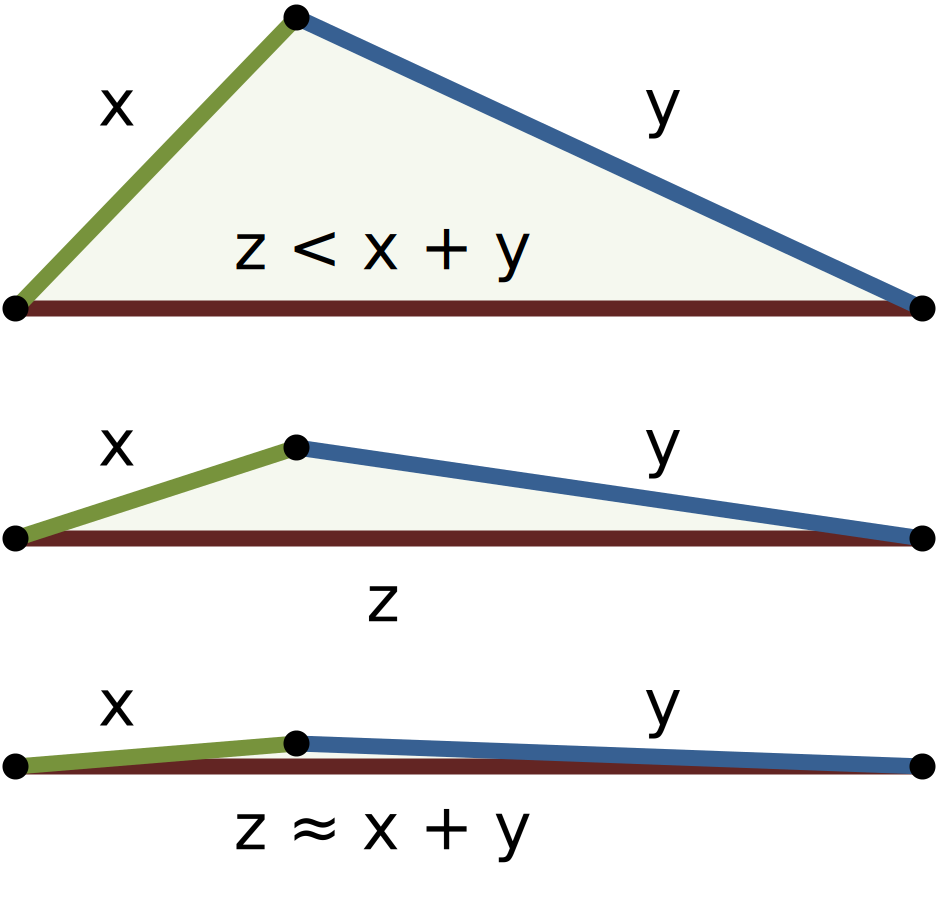

First, let's discuss preconditions. A precondition is an expectation applied to any parameters and existing variables when a method or function is called. Phrased a different way, the preconditions should all be true before the method is called. If all of the preconditions are met, the function can proceed and is expected to function properly. However, if any one of the preconditions are not met, the function may either reach an exception, prompt the user to correct the issue, or produce invalid output, depending on how it is written.

## Example - Area of a Triangle

Let's consider an example method to see how we can define the preconditions applied to that method. In this example, we're going to write a method `triangleArea(side1, side2, side3)` that will calculate the area of a triangle, given the lengths of the sides of the triangle. 

So, to determine what the preconditions of that method should be, we must think about what we know about a triangle and what sort of data we expect to receive. 

For example, we know that the length of each side should be a number. In addition, those lengths should all be positive, so each one must be strictly greater than $0$. 

We can also determine if we expect the length to be whole numbers or floating-point numbers. To make this example simpler, let's just work with whole numbers. 

When looking at preconditions, determining the types and expected range of values of each parameter is a major first step. However, sometimes we must also look at the relationship between the parameters to find additional preconditions that we must consider.

^[File:TriangleInequality.svg. (2015, July 10). Wikimedia Commons, the free media repository. Retrieved 23:22, January 21, 2020 from https://commons.wikimedia.org/w/index.php?title=File:TriangleInequality.svg&oldid=165448754.]

For example, the [triangle inequality](https://en.wikipedia.org/wiki/Triangle_inequality) states that the longest side of a triangle must be strictly shorter than the sum of the other two sides. Otherwise, those sides will not create a triangle. So, another precondition must state that the sides satisfy the triangle inequality. 

All together, we've found the following preconditions for our method `triangleArea(side1, side2, side3)`:

1. `side1`, `side2` and `side3` each must each be an integer that is strictly greater than $0$
1. `side1`, `side2` and `side3` must satisfy the triangle inequality

## Precondition Failures

What if our method is called and provided a set of parameters that do not meet the preconditions described above? As a programmer, there are several actions we can take in our code to deal with the situation.

### Exceptions

One of the most common ways to handle precondition failures is to simply throw or raise exceptions from our method as soon as it determines that the preconditions are not met. In this way, we can quickly indicate that the program is unable to perform the requested operation, and leave it up to the code that called that method to either handle the exception or ignore it and allow the program to crash.

This method is best used within the model portions of a program written using the Model-View-Controller or MVC architecture. By doing so, this allows our controller to react to problems quickly, usually by requesting additional input from the user using the view portion of the program.

### Prompt User

In simpler programs, it is common for the code to simply handle the precondition failure by asking the user for new input. This is commonly done in programs that are small enough to fit in a single class, instead of being developed using MVC architecture. 

### Incorrect Output

Of course, we could choose to simply ignore these precondition failures and allow our code to continue running. IN that case, if the preconditions are not met, then the answer we receive may be completely invalid. On the next page, we'll discuss how failed preconditions affect whether we can trust our method's output.
