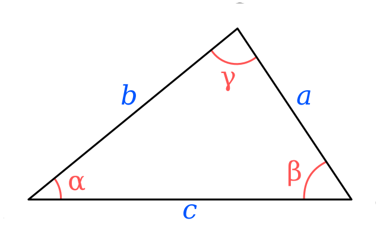

Next, we can discuss postconditions. A postcondition is a statement that is guaranteed to be true after a method is executed, provided all of the preconditions were met. If any one of the preconditions were not met, then we can't count on the postcondition being true either. This is the most important concept surrounding preconditions and postconditions.

{}

If the preconditions of a method are all true when a method is called, then we may assume the postconditions are true after the method is complete, provided it is written **correctly**.

{}

## Example - Area of a Triangle

On the last page, we discussed the preconditions for a method `triangleArea(side1, side2, side3)` that will calculate the area of a triangle given the lengths of its sides. Those preconditions are:

1. `side1`, `side2` and `side3` each must each be an integer that is strictly greater than $0$
1. `side1`, `side2` and `side3` must satisfy the triangle inequality

So, once the method completes, what should our postcondition be? In this case, we want to find a statement that would be always true if all of the preconditions are met. 

Since the method will be calculating the area of the triangle, the strongest postcondition we can use is the most obvious one:

1. The method will return the area of a triangle with side lengths `side1`, `side2` and `side3`

That's really it! 

Of course, there are a few other postconditions that we could consider, especially when we start working with data structures and objects. For example, one of the most powerful postconditions is the statement:

1. The values of the parameters are not modified from their original values

When we call a method that accepts an array or object as a parameter, we know that we can modify the values stored in that array or object because the parameter is handled in a _call-by-reference_ fashion in most languages. So, if we don't state that this postcondition applies, we can't guarantee that the method did not change the values in the array or object we provided as a parameter. 

## Precondition Failures: Incorrect Output

So, what if the preconditions are not met? Then what happens?

As we discussed on the previous page, if the preconditions are not met, then we cannot guarantee that the postcondition will be true once the method executes. In fact, it may be decidedly incorrect, depending on how we implement the method.

^[File:Triangle with notations 2 without points.svg. (2018, December 5). Wikimedia Commons, the free media repository. Retrieved 00:03, January 22, 2020 from https://commons.wikimedia.org/w/index.php?title=File:Triangle_with_notations_2_without_points.svg&oldid=330397605.]

For example, the simplest way to find the area of a triangle given the lengths of all three sides is [Heron's formula](https://en.wikipedia.org/wiki/Heron%27s_formula), which can be written mathematically as:

$$
A = 1/4 \sqrt{(a + b + c)(-a + b + c)(a - b + c)(a + b - c)}
$$

Since this is a mathematical formula, it is always possible to get a result from it, even if all of the preconditions are not met. For example, the inputs could be floating-point values instead of integers, or they may not satisfy the triangle inequality. In that case, the function may still produce a result, but it will not represent the actual area of the triangle described, mainly because the parameters provided describe a triangle that cannot exist in the real world. So, we must always be careful not to assume that a method will always provide the correct output unless we provide parameters that make all of its preconditions true. 
