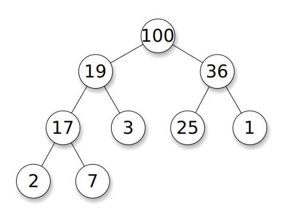

^[File:Max-Heap.svg. (2014, December 28). Wikimedia Commons, the free media repository. Retrieved 03:25, February 8, 2020 from https://commons.wikimedia.org/w/index.php?title=File:Max-Heap.svg&oldid=144372033.]

The last non-linear data structure we'll talk about is the _heap_, which is a specialized version of a tree. In a _heap_, we try to accomplish a few goals:

1. Store either the largest or smallest element in the heap at the root node,
2. Ensure that each parent node is either larger or smaller than all of its children, and
3. Minimize the height, or number of levels, of the tree.

If we follow those three guidelines, a heap becomes the most efficient data structure for managing a set of data where we always want to get the maximum or minimum value each time we remove an element. These are typically called _priority queues_, since we remove items based on their priority instead of the order they entered the queue.

Because of this, heaps are very important in creating efficient algorithms that deal with ordered data. 

## When to Use a Heap

As discussed above, a heap is an excellent data structure for when we need to store elements and then always be able to quickly retrieve either the smallest or largest element in the data structure. Heaps are a very specific version of a tree that specialize in efficiency over everything else, so they are only really good for a few specific uses. 
