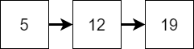

The next most common algorithmic technique is _divide and conquer_. A divide and conquer algorithm works just like it sounds. First, it will divide the problem into at least two or more smaller problems, and then it will try to solve each of those problems individually. It might even try to subdivide those smaller problems again and again to finally get to a small enough problem that it is easy to solve.

A great real-world example of using a divide and conquer approach to solving a problem is when we need to look for something that we've lost around the house. Instead of trying to search the entire house, we can subdivide the problem into smaller parts by looking in each room separately. Then, within each room, we can even further subdivide the problem by looking at each piece of furniture individually. By reducing the problem's size and complexity, it becomes easier to search through each individual piece of furniture in the house, either finding our lost object or eliminating that area as the likely location it will be found.

## Example - Binary Search

One great example of a divide and conquer algorithm is the _binary search_ algorithm. If we have a list of data that has already been sorted, as seen in the figure above, we can easily find any item in the list using a divide and conquer process.

For example, let's say we want to find the value $19$ in that list. First, we can look at the item in the middle of the list, which is $23$. Is it our desired number? Unfortunately, it is not. So, we need to figure out how we can use it to divide our input into a smaller problem. Thankfully, we know the list is sorted, so we can use that to our advantage. If our desired number is less than the middle number, we know that it must exist in the first half of the list. Likewise, if it is greater than the middle number, it must be in the second half. In this case, since $19$ is less than $23$, we must only look at the first half of the list.

Now we can just repeat that process, this time using only the first half of the original list. This is the powerful feature of a divide and conquer algorithm. Once we've figured out how to divide our data, we can usually follow the same steps again to solve the smaller problems as well. 

Once again, we ask ourselves if $12$, the centermost number in the list, is the one we are looking for. Once again, it is not, but we know that $19$ is greater than $12$, so we'll need to look in the second half of the list.

Finally, we have reduced our problem to the simplest, or _base case_ of the problem. Here, we simply need to determine if the single item in the list is the number we are looking for. In this case, it is! So, we can return that our original list did indeed include the number $19$. 

We'll explore many ways of using divide and conquer algorithms in this course, especially when we learn to sort and search through lists of values. 
