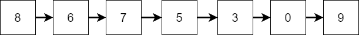
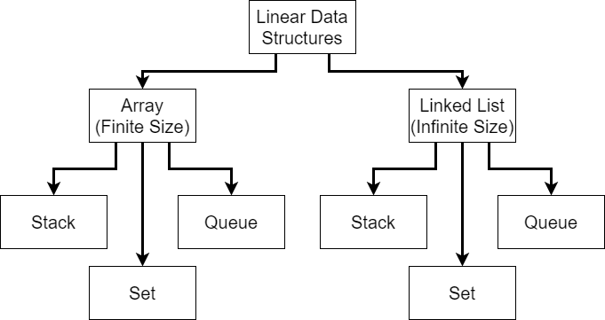

{}

First, we can broadly separate the data structures we're going to learn about into two types, _linear_ and _non-linear_ data structures.

A _linear_ data structure typically stores data in a single dimension, just like an array. By using a linear data structure, we would know that a particular element in the data structure comes before another element or vice-versa, but that's about it. A great example is seen in the image above. We have a list of numbers, and each element in the list comes before another element, as indicated by the arrows.

## Linear Data Structure Hierarchy

Linear data structures can further be divided into two types: arrays, which are typically finite sized; and linked lists, which can be infinitely sized. We've already worked with arrays extensively by this point, but linked lists are most likely a new concept. That's fine! We'll explore how to build our own later in this course.

Using either arrays or linked lists, we can build the three most commonly used linear data structures: _stacks_, _queues_, and _sets_. However, before we learn about each of those, let's review a bit more about what the _list_ data structure itself looks like. 

