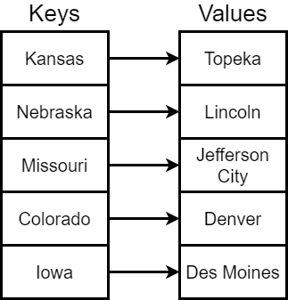
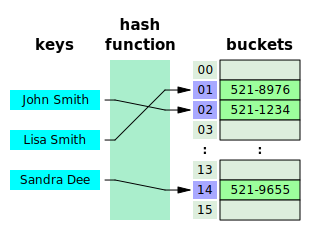

{}

The last of the linear data structures may seem linear from the outside, but inside it can be quite a bit more complex. 

The _map_ data structure is an example of a _key-value_ data structure, also known as a _dictionary_ or _associative array_. In the simplest case, a map data structure keeps track of a _key_ that uniquely identifies a particular _value_, and stores that value along with the _key_ in the data structure.

Then, to retrieve that _value_, the program must simply provide the same _key_ that was used to store it. 

In a way, this is very similar to how we use an array, since we provide an _array index_ to store and retrieve items from an array. The only difference is that the key in a map can be any data type! So it is a much more powerful data structure.

In fact, this data structure is one of the key ideas behind modern databases, allowing us to store and retrieve database records based on a unique primary key attached to each row in the database. 

## Map Operations

A map data structure should support the following operations:

* **put** - places a new value in the map using the given key,
* **get** - retrieves a value from the map using the given key,
* **entries** - gets all of the values in the map,
* **keys** - gets all of the keys in the map,
* **containsKey** - determines if the given key is in use in the map, and
* **containsValue** - determines if the given value is stored in the map.

Later in this course, we'll devote an entire module to learning how to build our own map data structures and explore these operations in more detail. 

## Hash Table

^[File:Hash table 3 1 1 0 1 0 0 SP.svg. (2019, August 21). Wikimedia Commons, the free media repository. Retrieved 02:46, February 8, 2020 from https://commons.wikimedia.org/w/index.php?title=File:Hash_table_3_1_1_0_1_0_0_SP.svg&oldid=362787583.]

One of the most common ways to implement the map data structure is through the use of a _hash table_. A hash table uses an array to store the _values_ in the map, and uses a special function called a _hash function_ to convert the given key to a simple number. This number represents the array index for the _value_. In that way, the same key will always find the value that was given.

But what if we have two keys that produce the same array index? In that case, we'll have to add some additional logic to our map to handle that situation. 

## When to Use a Map

Maps are great data structures when we need to store and retrieve data using a specific _key_. Just like we would store data in a database or put items in a numbered box to retrieve later, we can use a _map_ as a general purpose storage and retrieval data structure.

Of course, if our data items don't have unique keys assigned to them, then using a map may not be the best choice of data structure. Likewise, if each key is a sequential integer, we may be able to use an array just as easily. 
