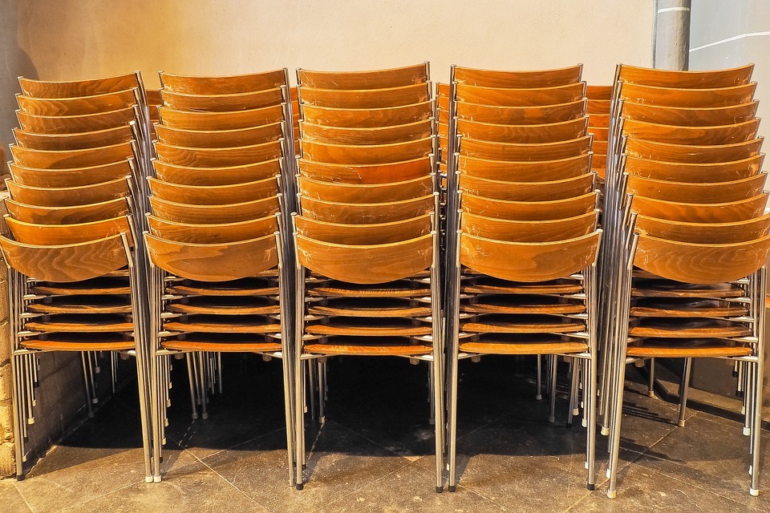

So, where do we see stacks in the real world? A great example is repairing an automobile. It is much easier to put a car back together if we put the pieces back on in the reverse order we took them off. Thus, as we take parts off a car, it is highly recommended that we lay them out in a line. Then, when we are ready to put things back together, we can just start at the last piece we took off and work our way back. This operation is exactly how a stack works.

Another example is a stack of chairs. Often in schools or in places that hold different types of events, chairs are stacked in large piles to make moving the chairs easier and to make their storage more efficient. Once again, however, if we are going to put chairs onto the stack or remove chairs from the stack, we are going to have to do it from the top.
