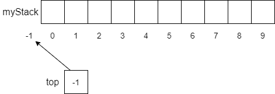
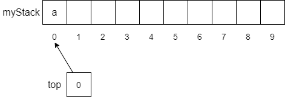
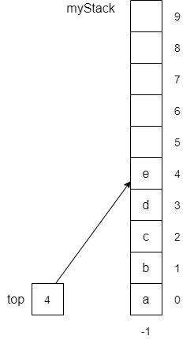

{}

How do we implement stacks in code? One way would be to use something we already understand, an array. Remember that arrays allow us to store multiple items, where each entry in the array has a unique index number. This is a great way to implement stacks. We can store items directly in the array and use a special `top` variable to hold the index of the top of the stack.

The following figure shows how we might implement a stack with an array. First, we define our array `myStack` to be an array that can hold 10 numbers, with an index of 0 to 9. Then we create a `top` variable that keeps track of the index at the top of the array. 



Notice that since we have not put any items onto the stack, we initialize `top` to be `-1`. Although this is not a legal index into the array, we can use it to recognize when the stack is empty, and it makes manipulating items in the array much simpler. When we want to `push` an item onto the stack, we follow a simple procedure as shown below. Of course, since our array has a fixed size, we need to make sure that we don't try to put an item in a full array. Thus, the precondition is that the array cannot be full. Enforcing this precondition is the function of the `if` statement at the beginning of the function. If the array is already full, then we'll throw an exception and let the user handle the situation. Next, we increment the `top` variable to point to the next available location to store our data. Then it is just a matter of storing the item into the array at the index stored in `top`. 

```tex
function PUSH(ITEM)
    if MYSTACK is full then
        throw exception
    end if
    TOP = TOP + 1
    MYSTACK[TOP] = ITEM
end function
```

If we call the function `push(a)` and follow the pseudocode above, we will get an array with `a` stored in `myStack[0]` and `top` will have the value `0` as shown below.


 
As we push items onto the stack, we continue to increment `top` and store the items on the stack. The figure below shows how the stack would look if we performed the following `push` operations.

```tex
push("b")
push("c")
push("d")
push("e")
```


 
Although we are implementing our stack with an array, we often show stacks vertically instead of horizontally as shown below. In this way the semantics of `top` makes more sense.


 
Of course, the next question you might ask is "how do we get items off the stack?”. As discussed above, we have a special operation called `pop` to take care of that for us. The pseudocode for the `pop` operation is shown below and is similar in structure to the `push` operation. 

```tex
function POP
    if TOP == -1 then
        throw exception
    end if
    TOP = TOP - 1
    return MYSTACK[TOP + 1]
end function
```

However, instead of checking to see if the stack is full, we need to check if the stack is empty. Thus, our precondition is that the stack is not empty, which we evaluate by checking if `top` is equal to `-1`. If it is, we simply throw an exception and let the user handle it. If `myStack` is not empty, then we can go ahead and perform the `pop` function. We simply decrement the value of `top` and return the value stored in `myStack[top+1]`. 

Now, if we perform three straight `pop` operations, we get the following stack.
 

