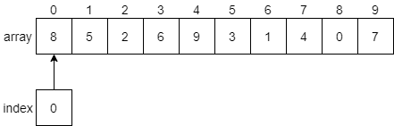
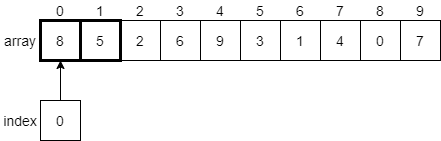
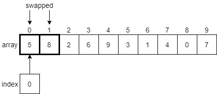
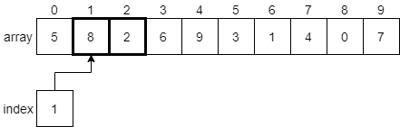
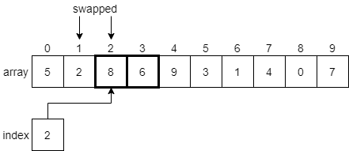
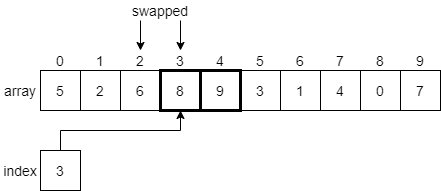
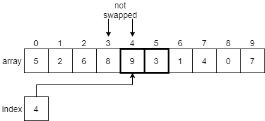
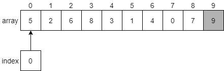
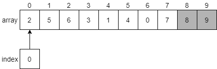

{}

Next, let's look at another sorting algorithm, bubble sort. The basic idea behind bubble sort is to continuously iterate through the array and swap adjacent elements that are out of order. As a side effect of this process, the largest element in the array will be "bubbled" to the end of the array after the first iteration. Subsequent iterations will do the same for each of the next largest elements, until eventually the entire list is sorted.  

Wikipedia includes a great animation that shows this process:

^[File:Bubble-sort-example-300px.gif. (2019, June 12). Wikimedia Commons, the free media repository. Retrieved 22:36, March 23, 2020 from https://commons.wikimedia.org/w/index.php?title=File:Bubble-sort-example-300px.gif&oldid=354097364.
]
In this animation, the two red boxes slowly move through the array, comparing adjacent elements. If the elements are not in the correct order (that is, the first element is larger than the second element), then it will swap them. Once it reaches the end, the largest element, 8, will be placed at the end and locked in place. 

## Bubble Sort Example

Let's walk through a few steps of this process and see how it works. We'll use the array we used previously for selection sort, just to keep things simple. At first, the array will look like the diagram below.

We'll begin with the `index` variable pointing at index 0. Our algorithm should compare the values at index 0 and index 1 and see if they need to be swapped. We'll put a bold border around the elements we are currently comparing in the figure below.

 
Since the element at index 0 is 8, and the element at index 1 is 5, we know that they must be swapped since 8 is greater than 5. We need to swap those two elements in the array, as shown below.

 
Once those two elements have been swapped, the index variable will be incremented by 1, and we'll look at the elements at indexes 1 and 2 next.

Since 8 is greater than 2, we'll swap these two elements before incrementing index to 2 and comparing the next two elements.

Again, we'll find that 8 is greater than 6, so we'll swap these two elements and move on to index 3. 

Now we are looking at the element at index 3, which is 8, and the element at index 4, which is 9. In this case, 8 is less than 9, so we don't need to swap anything. We'll just increment index by 1 and look at the elements at indexes 4 and 5.

As we've done before, we'll find that 9 is greater than 3, so we'll need to swap those two items. In fact, as we continue to move through the array, we'll find that 9 is the largest item in the entire array, so we'll end up swapping it with every element down to the end of the array. At that point, it will be in its final position, so we'll lock it and restart the process again.

After making a second pass through the array, swapping elements that must be swapped as we find them, we'll eventually get to the end and find that 8 should be placed at index 8 since it is the next largest value in the array.

 
We can then continue this process until we have locked each element in place at the end of the array. 
