{}

Another commonly used sorting algorithm is _merge sort_. Merge sort uses a recursive, divide and conquer approach to sorting, which makes it very powerful. It was actually developed to handle sorting data sets that were so large that they couldn't fit on a single memory device, way back in the early days of computing. 

The basic idea of the merge sort algorithm is as follows:

1. If the container only contains one or two elements, we can quickly sort that container by swapping the elements if needed. 
1. Otherwise, we should divide the container in half and recursively use merge sort on each half.
1. Once each half is sorted, we can then merge them back together into a single container. 

Once again, Wikipedia has a great animation showing this process:

^[File:Merge-sort-example-300px.gif. (2020, February 22). Wikimedia Commons, the free media repository. Retrieved 00:06, March 24, 2020 from https://commons.wikimedia.org/w/index.php?title=File:Merge-sort-example-300px.gif&oldid=397192885.]

## Merge Sort Example

Let's walk through a simple example and see how it works. First, we'll start with the same initial array as before, shown in the figure below. To help us keep track, we'll refer to this function call using the array indexes it covers. It will be `mergeSort(0, 9)`. 

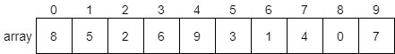
 
Since this array contains more than 2 elements, we won't be able to sort it quickly. Instead, we'll divide it in half, and sort each half using merge sort again. Let's continue the process with the first half of the array. We'll use a thick outline to show the current portion of the array we are sorting, but we'll retain the original array indexes to help keep track of everything. 

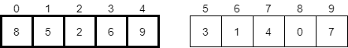
 
Now we are in the first recursive call, `mergeSort(0, 4)`,which is looking at the first half of the original array. Once again, we have more than 2 elements, so we'll split it in half and recursively call `mergeSort(0, 1)` first.

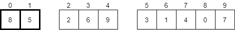
 
At this point, we now have an array with just 2 elements. We can use one of our base cases to sort that array by swapping the two elements, if needed. In this case, we should swap them, so we'll get the result shown below. 
 

Now that the first half of the smaller array has been sorted, our recursive call `mergeSort(0, 1)` will return and we'll look at the second half of the smaller array in the second recursive call, `mergeSort(2, 4)`, as highlighted below.

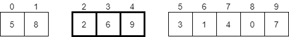
 
As we've seen before, this array has more than 2 elements, so we'll need to divide it in half and recursively call the function again. First, we'll call `mergeSort(2, 2)`.

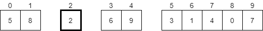
 
In this case, the current array we are considering contains a single element, so it is already sorted. Therefore, the recursive call to `mergeSort(2, 2)` will return quickly, and we'll consider the second part of the smaller array in `mergeSort(3, 4)`, highlighted below.

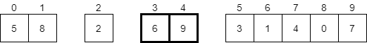
 
Here, we have 2 elements, and this time they are already sorted. So, we don't need to do anything, and our recursive call to `mergeSort(3, 4)` will return. At this point, we will be back in our call to `mergeSort(2, 4)`, and both halves of that array have been sorted. We're back to looking at the highlighted elements below. 

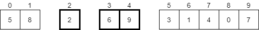
 
Now we have to merge these two arrays together. Thankfully, since they are sorted, we can follow this simple process:

1. Create a temporary array that has the same size as both halves combined.
1. Look at the first element of each half of the original array. Choose the smaller of the two.
1. Place that element first in the temporary array. 
1. Repeat steps 2 and 3 until one half is empty.
1. Place the remaining elements of the half that is not empty at the end of the temporary array.
1. Replace the original array with the temporary array. 

Let's take a look at what that process would look like. First, we'll create a new temporary array to store the result.

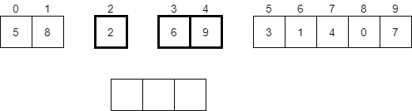
 
Next, we will look at the first element in each of the two sorted halves of the original array. In this case, we'll compare 2 and 6, which are highlighted below.

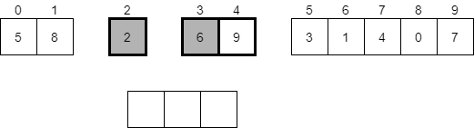
 
Now we should pick the smaller of those two values, which will be 2. That value will be placed in the new temporary array at the very beginning.

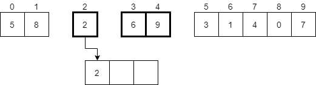
 
Next, we should look at the remaining halves of the array. Since the first half is empty, we can just place the remaining elements from the second half into the temporary array.

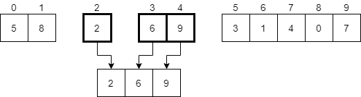

Finally, we should replace the portion of the original array that we are looking at in this recursive call with the temporary array. In most cases, we'll just copy these elements into the correct places in the original array. In the diagram, we'll just replace them. 

 
There we go! We've now completed the recursive call `mergeSort(2, 4)`. We can return from that recursive call and go back to `mergeSort(0, 4)`. 

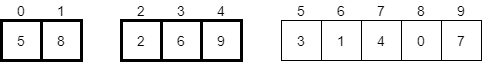
 
Since both halves of the array in `mergeSort(0, 4)` are sorted, we must do the merge process again.  We'll start with a new temporary array and compare the first element in each half. 

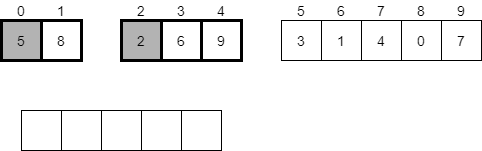
 
At this point, we'll see that 2 is the smaller of those elements, so we'll place it in the first slot in the temporary array and consider the next element in the second half. 

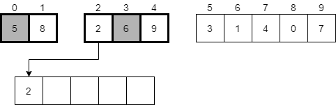
 
Next, we'll compare the values 5 and 6, and see that 5 is smaller. It should be placed in the next available element in our temporary array and we should continue onward.

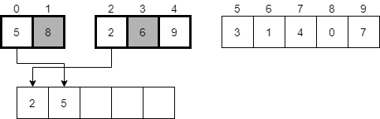

We'll repeat this process again, placing the 6 in the temporary array, then the 8, then finally the 9.  After completing the merge process, we'll have the following temporary array.

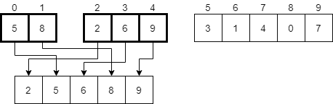
 
Finally, we'll replace the original elements with the now merged elements in the temporary array.

 
There we go! We've now completed the process in the `mergeSort(0, 4)` recursive call. Once that returns, we'll be back in our original call to `mergeSort(0, 9)`. In that function, we'll recursively call the process again on the second half of the array using `mergeSort(5, 9)`. 

Hopefully by now we understand that it will work just like we intended, so by the time that recursive call returns, we'll now have the second half of the array sorted as well.

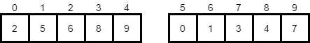
 
The last step in the original `mergeSort(0, 9)` function call is to merge these two halves together. So, once again, we'll follow that same process as before, creating a new temporary array and moving through the elements in each half, placing the smaller of the two in the new array. Once we are done, we'll end up with a temporary array that has been populated as shown below. 

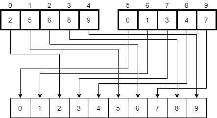
 
Finally, we'll replace the elements in the original array with the ones in the temporary array, resulting in a completely sorted result.

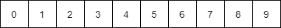
 
