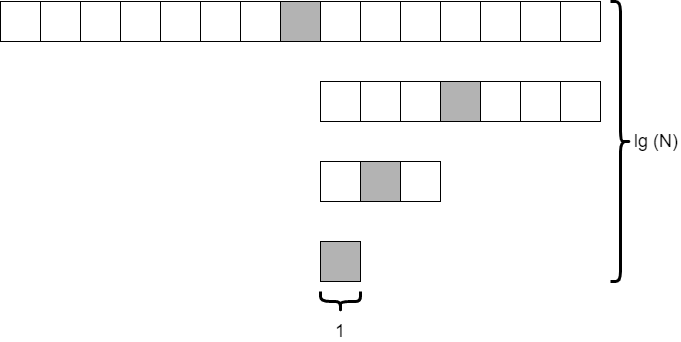

Analyzing the time complexity of binary search is similar to the analysis done with merge sort. In essence, we must determine how many times it must check the middle element of the array. 

In the worst case, it will continue to do this until it has determined that the `value` is not present in the array at all. Any time that our array doesn't contain our desired value would be our worst-case input. 

In that instance, how many times do we look at the middle element in the array? That is hard to measure. However, it might be easier to measure how many elements are in the array each time and go from there. 

Consider the situation where we start with 15 elements in the array. How many times can we divide the array in half before we are down to just a single element? The diagram below shows what this might look like.

 
As it turns out, this is similar to the analysis we did on merge sort and quick sort. If we divide the array in half each time, we will do this $\text{lg}(N)$ times. The only difference is that we are only looking at a single element, the shaded element, at each level. So the overall time complexity of binary search is on the order of $\text{lg}(N)$. That's pretty fast!
