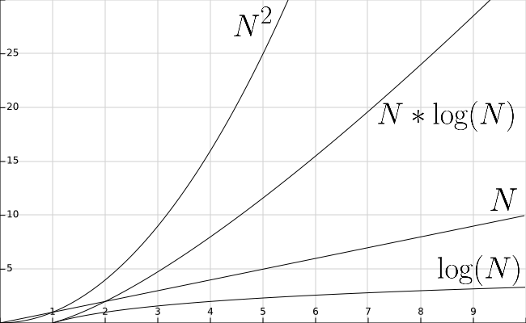

{}

Let's go back and look at the performance of our sorting algorithms, now that we know how quickly binary search can find a particular value in an array. Let's add the function $\text{lg}(N)$ to our graph from earlier, shown below.

 
As we can see, the function $\text{lg}(N)$ is even smaller than $N$. So performing a binary search is much faster than a linear search, which we already know runs in the order of $N$ time. 

However, performing a single linear search is still faster than any of the sorting algorithms we've reviewed. So when does it become advantageous to sort our data?

This is a difficult question to answer since it depends on many factors. However, a good rule of thumb is to remember that the larger the data set, or the more times we need to search for a value, the better off we are to sort the data before we search. 

In the graph below, the topmost line colored in red shows the approximate running time of $10$ linear search operations, while the bottom line in black shows the running time of performing a merge sort before $10$ binary search operations. 

 
As we can see, it is more efficient to perform a merge sort, which runs in $N * \text{lg}(N)$ time, then perform $10$ binary searches running in $\text{lg}(N)$ time, than it is to perform $10$ linear searches running in $N$ time. The savings become more pronounced as the size of the input gets larger, as indicated by the X axis on the graph.

In fact, this analysis suggests that it may only take as few as 7 searches to see this benefit, even on smaller data sets. So, if we are writing a program that needs to search for a specific value in an array more than about 7 times, it is probably a good idea to sort the array before doing our searches, at least from a performance standpoint.

{}

# Faster Sorting

So far we've looked at sorting algorithms that run in $N * \text{lg}(N)$ time. However, what if we try to sort the data as we add it to the array? In a later course, we'll learn how we can use an advanced data structure known as a _heap_ to create a sorted array in nearly linear time (with some important caveats, of course)!

{}
