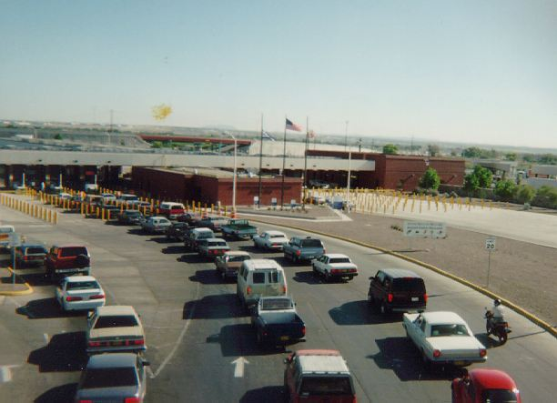

{}

The name for queues comes the word in British English used to describe a line of people. Instead of forming lines to wait for some service, British form queues. Thus, when we think of queues, often the first picture to come to mind is a group of people standing in a line. Of course, this is exactly how a computer queue operates as well. The first person in line gets served first. If I get into line before you do, then I will be served before you do.

^[File:BNSF GE Dash-9 C44-9W Kennewick - Wishram WA.jpg. (2019, July 1). Wikimedia Commons, the free media repository. Retrieved 19:30, March 30, 2020 from https://commons.wikimedia.org/w/index.php?title=File:BNSF_GE_Dash-9_C44-9W_Kennewick_-_Wishram_WA.jpg&oldid=356754103.]

Of course, there are other examples of queues besides lines of people. You can think of a train as a long line of railway cars. They are all connected and move together as the train engine pulls them. A line of cars waiting to go through a toll booth or to cross a border is another good example of a queue. The first car in line will be the first car to get through the toll booth. In the picture below, there are actually several lines. 

^[File:El Paso Ysleta Port of Entry.jpg. (2018, April 9). Wikimedia Commons, the free media repository. Retrieved 19:30, March 30, 2020 from https://commons.wikimedia.org/w/index.php?title=File:El_Paso_Ysleta_Port_of_Entry.jpg&oldid=296388002.]

