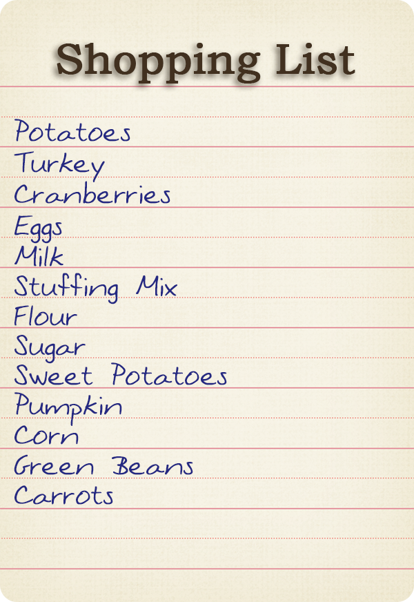

{}

A list is a data structure that holds a sequence of data, such as the shopping list shown below. Each list has a head item and a tail item, with all other items placed linearly between the head and the tail. As we pick up items in the store, we will remove them, or cross them off the list. Likewise, if we get a text from our housemate to get some cookies, we can add them to the list as well.

^[Source: https://www.agclassroom.org/teacher/matrix/lessonplan.cfm?lpid=367]

Lists are actually very general structures that we can use for a variety of purposes. One common example is the history section of a web browser. The web browser actually creates a list of past web pages we have visited, and each time we visit a new web page it is added to the list. That way, when we check our history, we can see all the web pages we have visited recently in the order we visited them. The list also allows us to scroll through the list and select one to revisit or select another one to remove from the history altogether.

Of course, we have already seen several instances of lists so far in programming, including arrays, stacks, and queues. However, lists are much more flexible than the arrays, stacks, and queues we have studied so far. Lists allow us to add or remove items from the head, tail, or anywhere in between. We will see how we can actually implement stacks and queues using lists later in this module.
