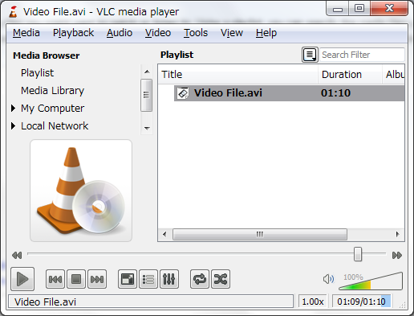

Most of us see and use lists every day. We have a list for shopping as we saw above, but we may also have a "to do" list, a list of homework assignments, or a list of movies we want to watch. Some of us are list-makers and some are not, but we all know a list when we see it.

^[Source: https://wiki.videolan.org/index.php?title=File:Basic_playlist_default.png&oldid=59730]

However, there are other lists in the real world that we might not even think of as a list. For instance, a playlist on our favorite music app is an example of a list. A music app lets us move forward or backward in a list or choose a song randomly from a list. We can even reorder our list whenever we want. 

All the examples we've seen for stacks and queues can be thought of as lists as well. Stacks of chairs or moving boxes, railroad trains, and cars going through a tollbooth are all examples of special types of lists.
