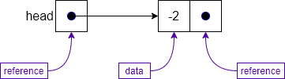
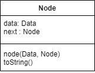
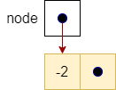
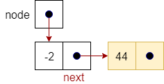
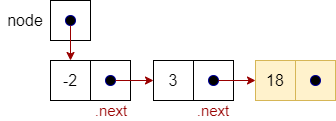
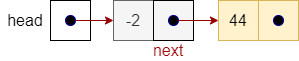

{}

## Linked Node

To solve the disadvantages of arrays, we need a data structure that allows us to insert and remove items in an ordered collection in constant time, independently from the number of items in the data structure.

The solution lies in creating our own specialized data structure where each node contains the data of interest as well as a reference, or pointer to the next node in the list. Of course, we would also need to have a pointer to the first node in the list, which we call the `head`.

The figure below shows how we can construct a linked list data structure. The `head` entity shown in the figure is a variable that contains a pointer to the first node in the list, in this case the node containing `-2`. Each node in the list is an object that has two main parts: the data that it holds, and a pointer to the next item in the list. 


 
The class representation of a singly linked list `Node` is shown below. As discussed above, we have two attributes: `data`, which holds the data of the node, and `next`, which is a reference or pointer to the next node. We also use a constructor and a standard `toString` operation to appropriately create a string representation for the data stored in the node.


 
## Linked List

A list is represented by a special variable `head` that contains a pointer to the first item in the list. If the `head` is `null` (equal to `0`), then we have an empty list, which is a list with no items in it.

However, if we have items in the list, `head` will point to a node as shown in the figure below. This node has some data (in this case `-2`) and its own pointer that points to the next node in the list. As we can see in our example, `head` points to a sequence of five nodes that makes up our list. The node with the data 67 in it is the last item in the list since its pointer is `null`. We often refer to this condition as having a `null` pointer.


 
While we will not show them explicitly in this module, each pointer is actually an address in memory. If we have a pointer to node `X` in our node, that means that we actually store the address of `X` in memory in our node.

## Linked List Class

To capture the necessary details for a singly linked list, we put everything into a class. The singly linked list class has two attributes: 

* `list`---the pointer to the first node in the list, and
* `size`---an integer to keep track of the number of items in the list.

```tex
Class SingleLinkedList 
    Node head
    Integer size = 0
```

While we would normally create getter and setter methods for each attribute in the class, to simplify and clarify our pseudocode below we use "dot notation" to refer directly to the attributes in the node. The following table illustrates our usage in this module.

| Use | Meaning |
|:---:|:-------:|
| `node` |  |  
| `node.next` |  |  
| `node.next.next` |  |  
| `head` |  |  
| `head.next` |  |  
