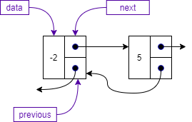

{}

With singly linked lists, each node in the list had a pointer to the next node in the list. This structure allowed us to grow and shrink the list as needed and gave us the ability to insert and delete nodes at the front, middle, or end of the list. However, we often had to use two pointers when manipulating the list to allow us to access the previous node in the list as well as the current node. One way to solve this problem and make our list even more flexible is to allow a node to point at both the previous node in the list as well as the next node in the list. We call this a doubly linked list.

The concept of a doubly linked list is shown below. Here, each node in the list has a link to the next node and a link to the previous node. If there is no previous or next node, we set the pointers to null.


 
## Doubly Linked Node

A doubly linked list node is the same as a singly linked list node with the addition of the `previous` attribute that points to the previous node in the list as shown below.


 
The class representation of a doubly linked list `Node` is shown below. As discussed above, we have three attributes: 

* `data`, which holds the data of the node, 
* `next`, which is a pointer to the next node, and 
* `previous`, which is a pointer to the previous node. 

We also use a constructor and the standard `toString` operation to create a string for the data stored in the node.


 
## Doubly Linked List

As with our singly linked list, we start off a doubly linked list with a pointer to the first node in the list, which we call `head`. However, if we also store the pointer to the last node in the list, we can simplify some of our insertion and removal operations as well as reduce the time complexity of operations that insert, remove, or peek at the last node in the list.

The figure below shows a doubly linked list with five nodes. The variable `head` points to the first node in the list, while the variable `tail` points to the last node in the list. Each node in the list now has two pointers, `next` and `previous`, which point to the appropriate node in the list. Notice that the first node's `previous` pointer is null, while the last node's `next` pointer is also null. 


 
## Doubly Linked List Class

Like we did for our singly linked list, we capture the necessary details for our doubly linked list in a class. The doubly linked list class has four attributes: 

* `head`---the pointer to the first node in the list,
* `tail`---the pointer to the last node in the list, 
* `current`---the pointer to the current node used by the iterator, and
* `size`---an integer to keep track of the number of items in the list.

```tex
Class DoubleLinkedList 
    Node head
    Node tail
    Node current
    Integer size = 0
```

